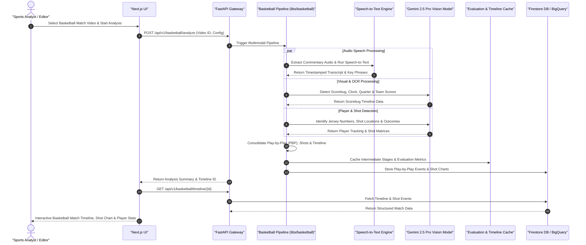

# Basketball Multimodal Video Analysis Sequence Diagram

This diagram documents the end-to-end AI analysis workflow for sports (basketball) video content, performing ASR speech recognition, scorebug OCR detection, jersey/player identification, shot detection, and automated play-by-play synthesis.

## Key Technical Steps

1. **Commentary ASR Integration**: Transcribes speech to capture play calls, referee announcements, and player names.
2. **Scorebug Visual OCR**: Periodically samples video frames to read live scores, shot clocks, and period indicators.
3. **Jersey & Shot Matrix**: Detects player jersey numbers and maps field goal attempts onto shot location charts.
4. **Timeline Synthesis**: Combines vision, speech, and OCR into a unified interactive match timeline.
