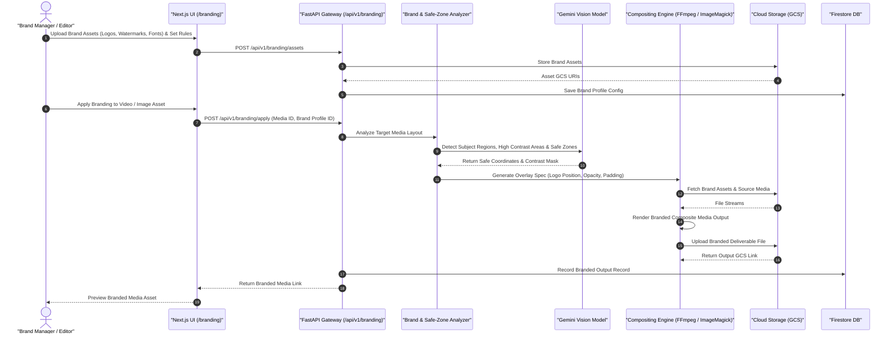

# Branding & Visual Asset Processing Sequence Diagram

This diagram documents the workflow for brand asset management, automated safe-zone detection, logo overlay rules, and production rendering.

## Key Technical Steps

1. **Brand Profile Management**: Ingests company logos, typography, color palettes, and positioning guidelines.
2. **AI Safe-Zone Detection**: Uses Gemini visual reasoning to detect clutter-free, non-essential regions for logo positioning.
3. **Automated Compositing**: Renders dynamic watermarks and overlays using FFmpeg / image processing tools.
