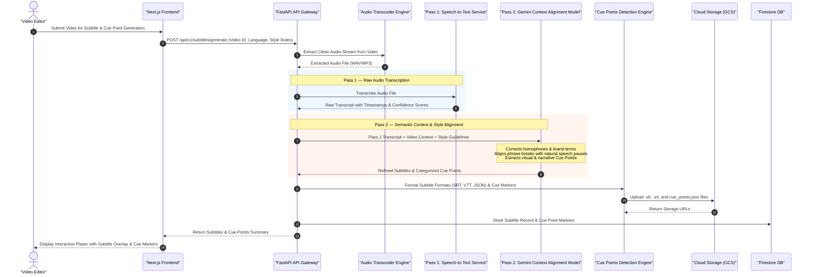

# Cue Points Detection & 2-Pass Subtitle Pipeline Sequence Diagram

This sequence diagram details the 2-pass subtitle generation and cue points detection workflow, combining Speech-to-Text with Gemini AI pass refinement for high accuracy and context-aware styling.

## Key Technical Steps

1. **Pass 1 ASR**: Rapidly converts speech to initial timestamped text transcript.
2. **Pass 2 Gemini Refinement**: Uses Gemini visual/narrative awareness to fix typos, align line-breaks naturally, and identify narrative shift cue points.
3. **Multi-Format Export**: Generates standard web captions (`.vtt`, `.srt`) and structured cue point data for automated video editing.
