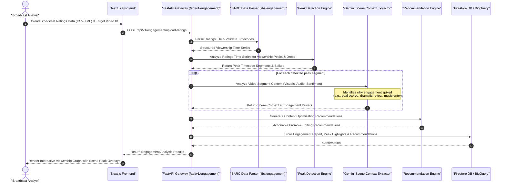

# Engagement Analytics & Peak Detection Sequence Diagram

This document details the sequence flow for content engagement analysis, parsing audience measurement data (e.g. BARC viewership ratings), identifying viewership peak moments, extracting scene context, and generating content recommendations.

## Key Technical Steps

1. **Rating Time-Series Parsing**: Ingests audience metrics (BARC data) and normalizes timestamps relative to video playback.
2. **Mathematical Peak Detection**: Algorithms detect statistically significant viewership spikes and retention drop-offs.
3. **Multimodal Scene Attribution**: Uses Gemini to explain *why* audience engagement spiked during specific timeframes.
