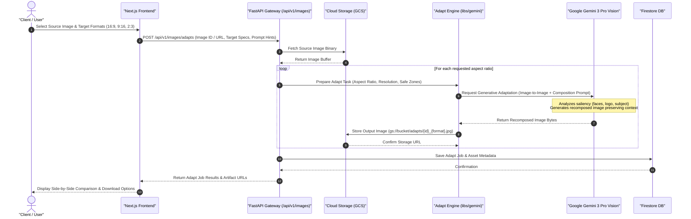

# Image Adaptation ("Adapts") Sequence Diagram

This document illustrates the sequence flow for AI-powered generative image adaptation, converting hero visual assets into targeted aspect ratios and compositions (e.g. 16:9 thumbnails, 2:3 posters, 9:16 story formats) powered by Gemini Vision models.

## Key Technical Steps

1. **Saliency Preservation**: Identifies key focal points (characters, products, titles) using Gemini visual reasoning.
2. **Generative Recomposition**: Natively generates requested target aspect ratios without naive stretching or harsh letterboxing.
3. **Storage & Delivery**: Saves resulting high-resolution artifacts to Cloud Storage and updates Firestore records.
