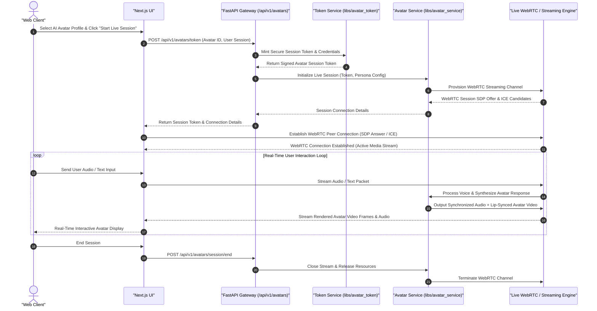

# Live Interactive AI Avatars Sequence Diagram

This sequence diagram documents the authentication, session creation, token handling, and live streaming interactions with AI Avatars.

## Key Technical Steps

1. **Session Authentication**: Issues secure ephemeral tokens to restrict avatar session access.
2. **WebRTC Peer Handshake**: Establishes low-latency WebRTC streams between client and streaming backend.
3. **Synchronized Lip-Sync**: Delivers real-time multimodal responses with lip-synced video output.
