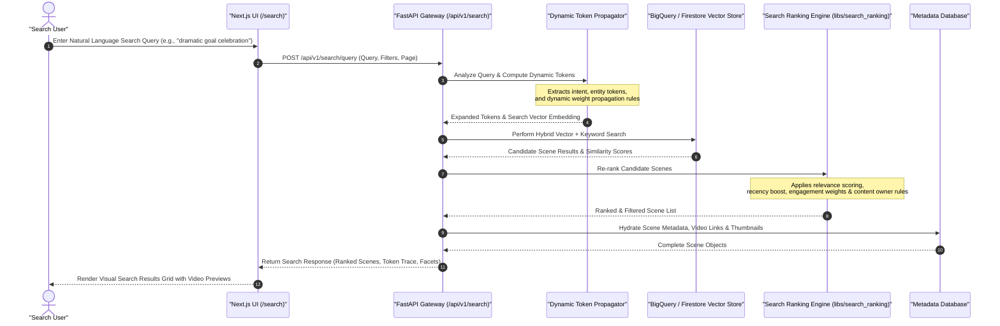

# Vector Search & Dynamic Token Propagation Sequence Diagram

This document details the search, ranking, and dynamic token propagation workflow across the multimodal catalog.

## Key Technical Steps

1. **Dynamic Token Propagation**: Expands raw user queries with dynamic contextual tokens and weights.
2. **Hybrid Search**: Combines dense vector semantic similarity search with keyword text matching.
3. **Multi-Factor Ranking**: Re-ranks candidates taking visual relevance, content recency, and engagement signals into account.
