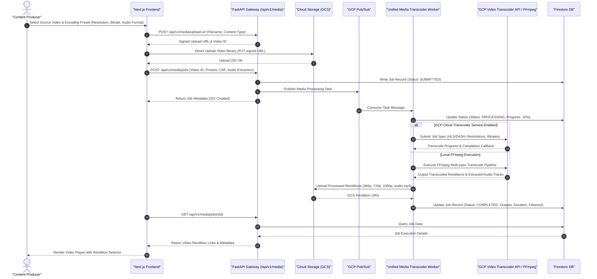

# Video Production & Transcoding Pipeline Sequence Diagram

This document illustrates the core video production workflow, including media upload, automated multi-resolution video transcoding (360p to 4K), audio track extraction, and job execution management.

## Key Technical Steps

1. **Direct-to-GCS Upload**: Bypasses backend API bottleneck by generating signed GCS URLs for fast uploads.
2. **Asynchronous Task Queue**: Uses Pub/Sub messaging for worker decoupling and load distribution.
3. **Multi-Rendition Output**: Generates multiple bitrate renditions and isolated audio streams in parallel.
