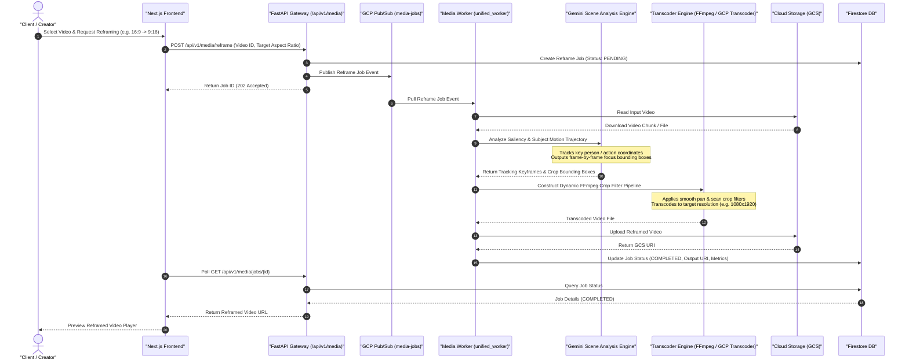

# Video Reframing & Dynamic Crop Sequence Diagram

This diagram details the sequence flow for intelligent video reframing, where horizontal (16:9) video content is automatically cropped and reframed into vertical (9:16) or square (1:1) compositions while tracking subject movement and action.

## Key Technical Steps

1. **Subject Detection & Motion Tracking**: Uses Gemini scene analysis to detect action centroids frame-by-frame.
2. **Crop Filter Synthesis**: Synthesizes smooth dynamic panning coordinates (`crop=w:h:x:y`) to prevent camera jitter.
3. **Hardware Acceleration**: Executes FFmpeg transcoding via worker infrastructure to output multi-format deliverables.
