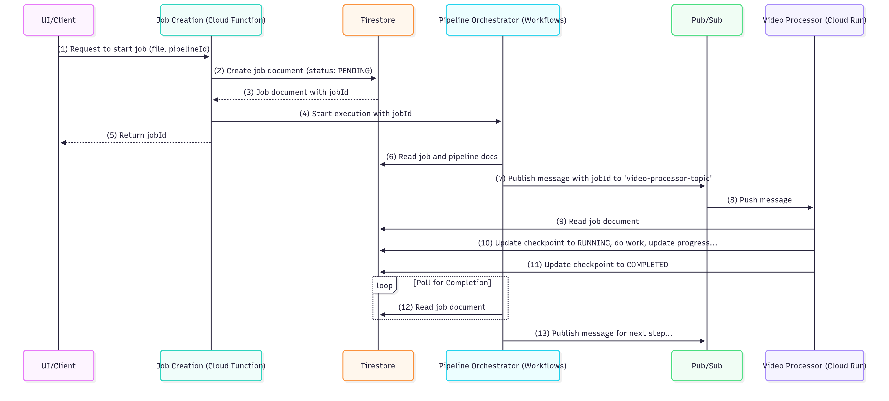

# Low-Level Design: Super Over Alchemy Backend

### 1. Design Philosophy

The architecture is a collection of independent, single-responsibility microservices orchestrated by a central workflow
engine. State is externalized to a central database (Firestore), making the services themselves stateless, scalable, and
resilient. Communication is asynchronous via a message bus (Pub/Sub). This modular design allows any service to be
updated, tested, or scaled independently and enables the dynamic composition of processing pipelines.

---

### 2. Data Models (Firestore Collections)

Firestore serves as the single source of truth for the state of all operations.

#### a) `jobs` Collection

- **Document ID:** `jobId` (e.g., a UUID generated upon creation)
- **Purpose:** Tracks the end-to-end lifecycle of a single processing request.

| Field         | Type        | Description                                                                                                                                             |
| :------------ | :---------- | :------------------------------------------------------------------------------------------------------------------------------------------------------ |
| `jobId`       | `string`    | Unique identifier for the job.                                                                                                                          |
| `status`      | `string`    | The current state of the job. Enum: `PENDING`, `RUNNING`, `PAUSED`, `COMPLETED`, `FAILED`, `CANCELLED`.                                                 |
| `pipelineId`  | `string`    | The ID of the pipeline definition used for this job.                                                                                                    |
| `sourceFile`  | `string`    | The original GCS path of the file to be processed.                                                                                                      |
| `createdAt`   | `timestamp` | Timestamp of job creation.                                                                                                                              |
| `updatedAt`   | `timestamp` | Timestamp of the last modification.                                                                                                                     |
| `retryCount`  | `number`    | The number of times the current step has been retried.                                                                                                  |
| `checkpoints` | `map`       | Tracks the completion of individual pipeline steps. Keys are service names. Example: `{ "video-processor": "COMPLETED", "audio-extractor": "RUNNING" }` |
| `progress`    | `map`       | Detailed progress for long-running, multi-unit tasks. Example: `{ "scene-analyzer": { "completed": 5, "total": 10 } }`                                  |
| `outputs`     | `map`       | A map of service names to their final output manifest/file paths.                                                                                       |
| `error`       | `string`    | Stores the last error message if the job failed. `null` otherwise.                                                                                      |

#### b) `pipelines` Collection

- **Document ID:** `pipelineId` (e.g., `full-analysis`, `audio-only`)
- **Purpose:** Defines reusable processing workflows that can be selected by the user.

| Field                 | Type     | Description                                                        |
| :-------------------- | :------- | :----------------------------------------------------------------- |
| `name`                | `string` | User-friendly name for the pipeline (e.g., "Full Video Analysis"). |
| `description`         | `string` | A brief description of what the pipeline does.                     |
| `steps`               | `array`  | An ordered array of step objects.                                  |
| `steps[].order`       | `number` | The execution order of the step (e.g., 1, 2, 3).                   |
| `steps[].serviceName` | `string` | A unique identifier for the service (e.g., `video-processor`).     |
| `steps[].topic`       | `string` | The Pub/Sub topic to publish to in order to trigger this service.  |

---

### 3. Component Breakdown

#### a) Job Creation Service

- **Technology:** Cloud Function
- **Single Responsibility:** To create a job's state record and initiate the orchestration.
- **Trigger:** HTTPS Request (from the future UI or an API call).
- **Inputs:** JSON body containing `sourceFile` and `pipelineId`.
- **Processing Logic:**
  1.  Generate a new `jobId`.
  2.  Create a new document in the `jobs` collection with the `jobId`, inputs, and a status of `PENDING`.
  3.  Start a Cloud Workflow execution, passing the `jobId` as an argument.
  4.  Return the `jobId` to the caller.
- **Outputs:** An HTTP response with the `jobId`.

#### b) Pipeline Orchestrator

- **Technology:** Cloud Workflows
- **Single Responsibility:** To execute the steps of a pipeline in the correct order based on its definition.
- **Trigger:** Started by the Job Creation Service.
- **Inputs:** `jobId`.
- **Processing Logic:**
  1.  Read the job document and its associated pipeline document from Firestore.
  2.  Update the job `status` to `RUNNING`.
  3.  Iterate through the `steps` array in the pipeline document, ordered by `order`.
  4.  For each step: a. Check the `checkpoints` in the job document. If the step is already `COMPLETED`, skip it. b.
      Publish a message containing the `jobId` to the Pub/Sub `topic` defined for that step. c. Enter a polling loop: i.
      Wait for a defined interval (e.g., 10 seconds). ii. Re-read the job document from Firestore. iii. If
      `checkpoints[serviceName]` is `COMPLETED`, exit the loop and proceed to the next step. iv. If `status` is
      `FAILED`, `PAUSED`, or `CANCELLED`, terminate the workflow execution.
  5.  After the final step is complete, update the job `status` to `COMPLETED`.
- **Outputs:** Updates to the job document in Firestore.

#### c) Worker Services (Generic LLD for all modules)

- **Technology:** Cloud Run
- **Single Responsibility:** To execute a single, specific task (e.g., chunk video, analyze scene) for a given job and
  update its state in Firestore.
- **Trigger:** Pub/Sub Push Subscription.
- **Inputs:** Pub/Sub message containing a `jobId`.
- **Processing Logic:**
  1.  Receive the message and extract the `jobId`.
  2.  **Read** the job document from Firestore.
  3.  **Pre-flight Checks:** a. If `status` is `PAUSED` or `CANCELLED`, stop processing and acknowledge the Pub/Sub
      message immediately. b. If the `checkpoints[this_service_name]` is already `COMPLETED`, stop and acknowledge the
      message.
  4.  **Lock the Job:** Update the `checkpoints[this_service_name]` to `RUNNING`.
  5.  **Execute Core Task:** a. Perform the module's specific logic (e.g., download files via `StorageManager`, process
      with `ffmpeg`, call Gemini API). b. For long-running, multi-unit tasks (like scene analysis), **update the
      `progress` map in Firestore** after each unit is complete (e.g., after each chunk is analyzed). c. During this
      process, periodically re-read the job document to check for `PAUSED` or `CANCELLED` signals.
  6.  **Handle Completion:** a. On success, update `checkpoints[this_service_name]` to `COMPLETED` and write any output
      paths to the `outputs` map in Firestore. b. Acknowledge the Pub/Sub message (by returning an HTTP `2xx` status).
  7.  **Handle Failure:** a. On failure, `catch` the exception. b. Update the job `status` to `FAILED` and write the
      exception details to the `error` field in Firestore. c. Negatively acknowledge the Pub/Sub message (by returning
      an HTTP `5xx` status) to allow for retries.
- **Outputs:** Updates to the job document in Firestore; files written to GCS.

---

### 4. Sequence Diagram: Job Execution (Happy Path)

