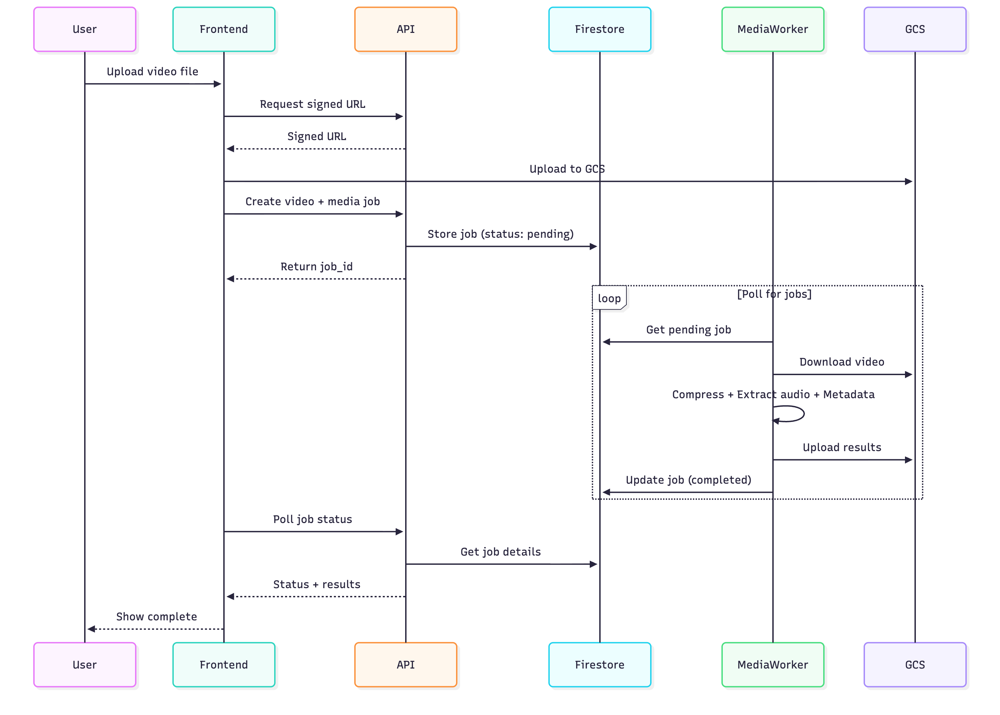

# Media Worker - Sequence Diagram

## Key Points

### Worker Lifecycle

1. **Initialization**: Worker starts and connects to Firestore
2. **Polling Loop**: Continuously polls for pending jobs (5 second interval)
3. **Job Processing**: Picks up jobs, updates status, processes media
4. **Cleanup**: Removes temporary files after processing

### Job States

- **pending**: Job created, waiting for worker
- **processing**: Worker actively processing
- **completed**: Processing finished successfully
- **failed**: Processing encountered an error

### Configuration

- `compress_resolution`: Target resolution (360p-2160p)
- `audio_format`: Output format (mp3, aac, wav)
- `audio_bitrate`: Audio bitrate (128k, 192k, 256k, 320k)
- `crf`: Constant Rate Factor (0-51, lower = better quality)
- `preset`: Encoding speed (ultrafast, fast, medium, slow, veryslow)

### Error Handling

- All errors caught and logged
- Job status updated to "failed" with error message
- Worker continues to next job
- Temp files cleaned up even on failure
