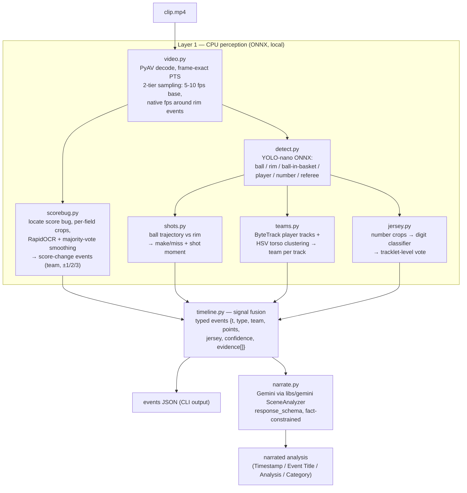
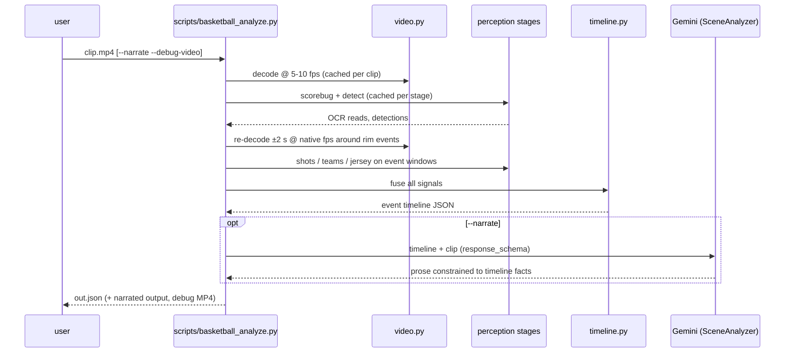

# Plan: Basketball Video Analysis CLI

Spec: [`docs/specs/basketball-video-analysis.md`](../../specs/basketball-video-analysis.md)

## Context

Gemini-only prompting misidentifies basketball events (wrong shot outcomes, swapped teams, wrong jersey numbers, imprecise timestamps). This plan builds a local CLI where **deterministic CPU perception owns the timestamps and facts, and Gemini owns only the prose** — the same rule as `docs/tech/cue-points-detection.md`. V1 scope: scoring events (made/missed, team, scorer jersey, 2PT/3PT/FT, second-level timestamps) on 30-second broadcast clips.

## High-Level Design

### Component view

### Run sequence

### Fusion rules (the accuracy core)

1. A **make** requires trajectory-through-rim OR a `ball-in-basket` detection, confirmed by a score-bug delta within ~2 s.
2. The **timestamp** comes from the ball-through-rim moment; the OCR delta only confirms (the on-screen score lags ~1–2 s).
3. Shot detected but **no score delta → miss**; **score delta but no detected shot → emit the event from OCR alone** (lower confidence, timestamped by delta minus lag).
4. **Points** (1/2/3) come from the score delta; **team** from which side of the bug incremented; **scorer jersey** from the shooter's tracklet vote.
5. Every event carries per-attribute **confidence** and an **evidence list** (which signals contributed); narration hedges or omits attributes below threshold.

### Design decisions

- **Signals own timestamps; the LLM owns meaning** — Gemini never invents an event, timestamp, team, or number.
- **Stage caching** — every stage persists intermediate output (frames, detections, OCR reads) under a per-clip work dir; `--stage <name>` re-runs one stage against cache for fast iteration.
- **Separate `requirements-basketball.txt`** — the cloud services' dependency set stays untouched; this package introduces the repo's first local numeric stack (numpy, av, opencv-headless, onnxruntime, rapidocr, supervision).
- **No Firestore/GCS coupling** — `libs/basketball/` is pure local; only `narrate.py` touches the network (Vertex AI via existing `libs/gemini`).
- **One-time GPU fine-tune, CPU-only inference** — YOLO-nano fine-tuned on the Roboflow 10-class basketball dataset (Colab/hosted training), exported to ONNX/INT8.

## Epics

| Epic | Deliverable | Stories |
|------|-------------|---------|
| [Epic 1 — Foundation](epic-1-foundation/) | CLI skeleton, decode, cache, eval dataset + harness | [story-1-cli-scaffold](epic-1-foundation/story-1-cli-scaffold.md), [story-2-eval-dataset](epic-1-foundation/story-2-eval-dataset.md) |
| [Epic 2 — Scoring signals](epic-2-scoring-signals/) | Score-bug OCR, ball/rim detection, make/miss fusion | [story-1-scorebug-ocr](epic-2-scoring-signals/story-1-scorebug-ocr.md), [story-2-ball-rim-detection](epic-2-scoring-signals/story-2-ball-rim-detection.md), [story-3-shot-outcome-fusion](epic-2-scoring-signals/story-3-shot-outcome-fusion.md) |
| [Epic 3 — Attribution](epic-3-attribution/) | Player tracking, team assignment, jersey numbers | [story-1-tracking-and-teams](epic-3-attribution/story-1-tracking-and-teams.md), [story-2-jersey-numbers](epic-3-attribution/story-2-jersey-numbers.md) |
| [Epic 4 — Synthesis](epic-4-synthesis/) | Shot type, Gemini narration | [story-1-shot-type](epic-4-synthesis/story-1-shot-type.md), [story-2-gemini-narration](epic-4-synthesis/story-2-gemini-narration.md) |

Sequencing: Epic 1 → Epic 2 story 1 gives the first eval numbers with zero ML training. Epics 2–3 stories are independent after detection lands. Epic 4 last.

Out of V1 (tracked in spec): fouls/blocks/turnovers heuristics, play-by-play join, multi-broadcast generalization.

## Implementation status (2026-07-17)

**All 8 pipeline stages are implemented**: decode, scorebug, detect, shots, teams, jersey, fuse, narrate (`libs/basketball/`, registry in `stages.py`), plus the shared cut detector (`cuts.py`), the `--debug-video` renderer (`debug_video.py`), the CLI (`scripts/basketball_analyze.py`), and the eval harness (`evals/basketball/`). Epic-4 shot typing is in `timeline.py`: delta arithmetic, and-one splitting guard, consecutive-FT handling, free-throw scene corroboration, and never-guess missed-shot typing (warning in fusion_debug). A default run with no detection model degrades gracefully to scorebug-only events (`--stage detect` still fails loudly).

**Tests**: `tests/basketball/` — 314 passed, 9 skipped (all skips are `eval`-marker tests requiring the eval clips), 0 failed, in the standalone `.venv-basketball` environment. The main repo suite (`tests/libs`, `tests/api`) is unaffected. Everything is validated on synthetic PyAV-rendered fixtures (including a scripted broadcast score-bug clip); a full CLI run on that clip yields the expected scorebug-only events, warm-cache re-runs, and an annotated debug MP4.

**Open items** (blocking full acceptance-criteria measurement):

1. **Eval clips unreachable** — the CDN behind `sources.local.yaml` returns 403, so `build_dataset.py` cannot download the ~20 review clips: `manifest.yaml` checksums are still null, the manual labeling pass is pending, and every accuracy-based acceptance criterion (recall/precision, team/jersey/type accuracy, reviewer-flagged regressions) is unmeasured on real footage.
2. **Basketball YOLO fine-tune pending GPU** — only the COCO smoke-test fallback model (person/sports-ball) exists, so there are no rim / ball_in_basket / number / referee detections on real footage yet; Signal B, jersey reading, and the layup/dunk flavor all wait on the fine-tune (procedure in `libs/basketball/models/README.md`). Court homography (missed 2PT vs 3PT typing) stays deferred until eval data shows it is needed.
3. **`--narrate` needs optional deps + GCP env** — google-genai + google-api-core (commented in `requirements-basketball.txt`) plus the repo root config env vars and ADC; without them the CLI exits 1 with an actionable error. The live Gemini integration test has therefore not been run.
