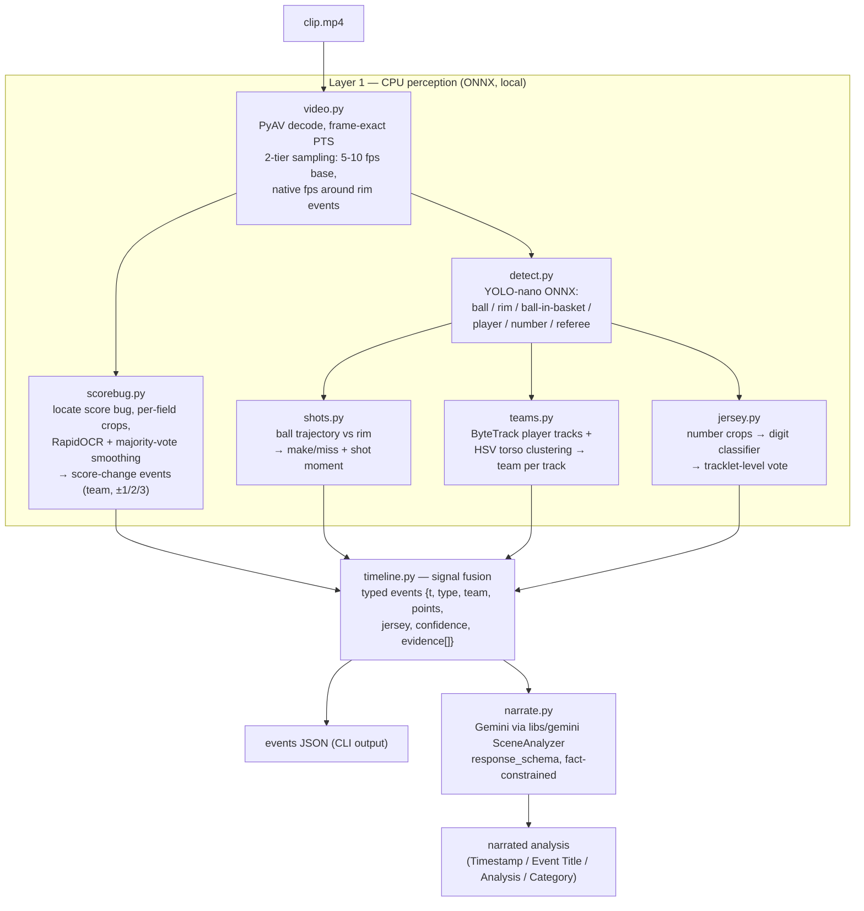
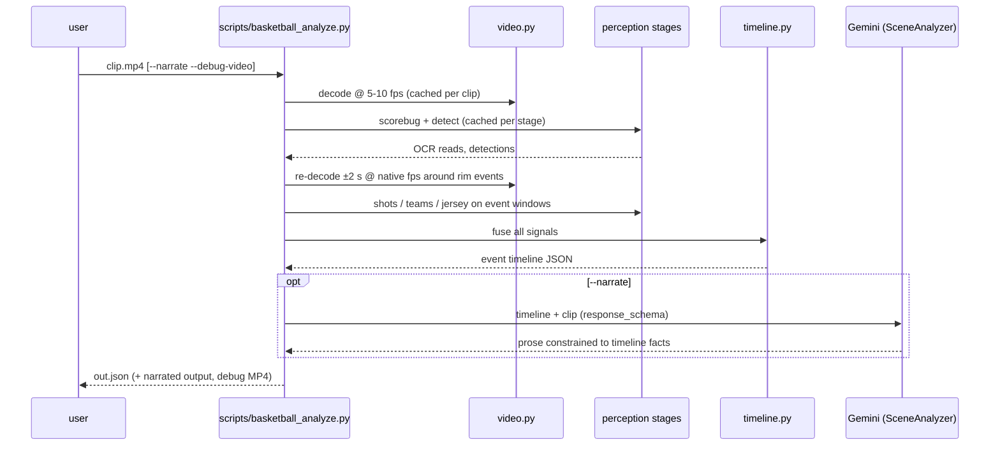

# Plan: Basketball Video Analysis CLI

Spec: [`docs/specs/basketball-video-analysis.md`](../../specs/basketball-video-analysis.md)

## Context

Gemini-only prompting misidentifies basketball events (wrong shot outcomes, swapped teams, wrong jersey numbers, imprecise timestamps). This plan builds a local CLI where **deterministic CPU perception owns the timestamps and facts, and Gemini owns only the prose** — the same rule as `docs/tech/cue-points-detection.md`. V1 scope: scoring events (made/missed, team, scorer jersey, 2PT/3PT/FT, second-level timestamps) on 30-second broadcast clips.

## High-Level Design

### Component view

### Run sequence

### Fusion rules (the accuracy core)

1. A **make** requires trajectory-through-rim OR a `ball-in-basket` detection, confirmed by a score-bug delta within ~2 s.
2. The **timestamp** comes from the ball-through-rim moment; the OCR delta only confirms (the on-screen score lags ~1–2 s).
3. Shot detected but **no score delta → miss**; **score delta but no detected shot → emit the event from OCR alone** (lower confidence, timestamped by delta minus lag).
4. **Points** (1/2/3) come from the score delta; **team** from which side of the bug incremented; **scorer jersey** from the shooter's tracklet vote.
5. Every event carries per-attribute **confidence** and an **evidence list** (which signals contributed); narration hedges or omits attributes below threshold.

### Design decisions

- **Signals own timestamps; the LLM owns meaning** — Gemini never invents an event, timestamp, team, or number.
- **Stage caching** — every stage persists intermediate output (frames, detections, OCR reads) under a per-clip work dir; `--stage <name>` re-runs one stage against cache for fast iteration.
- **Separate `requirements-basketball.txt`** — the cloud services' dependency set stays untouched; this package introduces the repo's first local numeric stack (numpy, av, opencv-headless, onnxruntime, rapidocr, supervision).
- **No Firestore/GCS coupling** — `libs/basketball/` is pure local; only `narrate.py` touches the network (Vertex AI via existing `libs/gemini`).
- **One-time GPU fine-tune, CPU-only inference** — YOLO-nano fine-tuned on the Roboflow 10-class basketball dataset (Colab/hosted training), exported to ONNX/INT8.

## Epics

| Epic | Deliverable | Stories |
|------|-------------|---------|
| [Epic 1 — Foundation](epic-1-foundation/) | CLI skeleton, decode, cache, eval dataset + harness | [story-1-cli-scaffold](epic-1-foundation/story-1-cli-scaffold.md), [story-2-eval-dataset](epic-1-foundation/story-2-eval-dataset.md) |
| [Epic 2 — Scoring signals](epic-2-scoring-signals/) | Score-bug OCR, ball/rim detection, make/miss fusion | [story-1-scorebug-ocr](epic-2-scoring-signals/story-1-scorebug-ocr.md), [story-2-ball-rim-detection](epic-2-scoring-signals/story-2-ball-rim-detection.md), [story-3-shot-outcome-fusion](epic-2-scoring-signals/story-3-shot-outcome-fusion.md) |
| [Epic 3 — Attribution](epic-3-attribution/) | Player tracking, team assignment, jersey numbers | [story-1-tracking-and-teams](epic-3-attribution/story-1-tracking-and-teams.md), [story-2-jersey-numbers](epic-3-attribution/story-2-jersey-numbers.md) |
| [Epic 4 — Synthesis](epic-4-synthesis/) | Shot type, Gemini narration | [story-1-shot-type](epic-4-synthesis/story-1-shot-type.md), [story-2-gemini-narration](epic-4-synthesis/story-2-gemini-narration.md) |

Sequencing: Epic 1 → Epic 2 story 1 gives the first eval numbers with zero ML training. Epics 2–3 stories are independent after detection lands. Epic 4 last.

Out of V1 (tracked in spec): fouls/blocks/turnovers heuristics, play-by-play join, multi-broadcast generalization.

## Implementation status (2026-07-17)

**All 8 pipeline stages are implemented**: decode, scorebug, detect, shots, teams, jersey, fuse, narrate (`libs/basketball/`, registry in `stages.py`), plus the shared cut detector (`cuts.py`), the `--debug-video` renderer (`debug_video.py`), the CLI (`scripts/basketball_analyze.py`), and the eval harness (`evals/basketball/`). Epic-4 shot typing is in `timeline.py`: delta arithmetic, and-one splitting guard, consecutive-FT handling, free-throw scene corroboration, and never-guess missed-shot typing (warning in fusion_debug). A default run with no detection model degrades gracefully to scorebug-only events (`--stage detect` still fails loudly).

**Tests**: `tests/basketball/` — 314 passed, 9 skipped (all skips are `eval`-marker tests requiring the eval clips), 0 failed, in the standalone `.venv-basketball` environment. The main repo suite (`tests/libs`, `tests/api`) is unaffected. Everything is validated on synthetic PyAV-rendered fixtures (including a scripted broadcast score-bug clip); a full CLI run on that clip yields the expected scorebug-only events, warm-cache re-runs, and an annotated debug MP4.

## V1 status: COMPLETE (2026-07)

All three blocking open items from the 2026-07-17 status are **resolved**, and V1
is measured on real footage. Full results: `docs/tech/basketball-eval-results.md`.

- ✅ **Eval clips** — the "CDN 403" was a single-character URL typo in the
  gitignored `sources.local.yaml` (a missing hyphen); all clips download,
  checksums are written, and the manifest is scoreboard-verified.
- ✅ **YOLO fine-tune** — trained on Vertex AI (L4 GPU), mAP50-95 = 0.574; ONNX
  runs CPU-only at ~52 ms/frame.
- ⏸️ **`--narrate`** — still gated on optional google-genai + GCP ADC (unchanged;
  the perception layer, which is the point, is complete).

**Final V1 metrics (22-clip review set): Precision 1.00, Recall 0.94, F1 0.97;
team 100%, points 100%, jersey 2/2.** Validated out-of-sample on a held-out
5-clip set (precision/recall 1.00 on makes).

**Two stages added beyond the original 8** to close jersey (0/2 → 2/2), since
jersey attribution via the shooter track cannot reach scoreboard-only makes:
`scorer` (OCR the scorer lower-third graphic) and `asr` (Whisper commentary
cross-validation + miss cues). Also landed: matcher span semantics, scoreboard
relabel, fuse dedup, scorebug symmetry fallback + confidence floor, and
`no_scoring` make-only semantics.

**Known V1 limitation** (recall, not a bug): missed shots that leave no score
delta AND are not narrated are the blind spot — e.g. shot_0013, a missed free
throw where the rim itself was not detected, so no trajectory candidate could
form. This is the one remaining FN. Closing it (ASR-created miss events, better
rim recall) is post-V1.

**V2 (in progress):** the **play-by-play join** (the scale/player-name lever) is
built — Phase 1, `pbp` stage — see `docs/tech/basketball-eval-results.md`. It
matches each make to the official ESPN PBP by `score_after` and attaches the
authoritative scorer name + jersey + shot type (15/15 makes, no regression).
Still deferred: PBP miss recall (Phase 2), fouls/blocks/turnovers, court
homography (missed 2PT vs 3PT), action recognition (shot flavor), and
multi-broadcast generalization — everything so far is one game.
