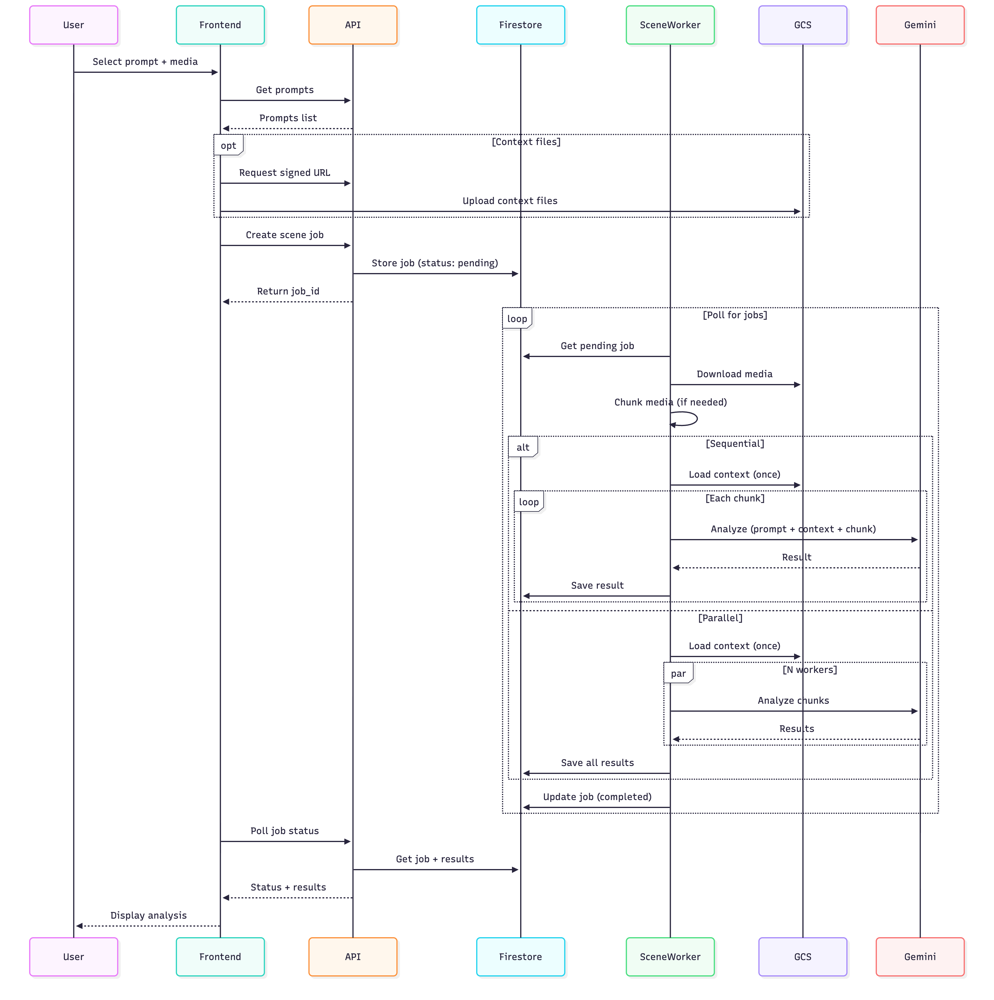

# Scene Worker - Sequence Diagram

## Key Points

### Worker Lifecycle

1. **Initialization**: Worker starts, connects to Firestore, initializes scene processor
2. **Polling Loop**: Continuously polls for pending scene jobs (5 second interval)
3. **Job Processing**: Picks up jobs, chunks media, analyzes with Gemini
4. **Cleanup**: Removes temporary files after processing

### Job States

- **pending**: Job created, waiting for worker
- **processing**: Worker actively processing
  - Sub-states: "chunking", "analyzing"
- **completed**: Analysis finished successfully
- **failed**: Processing encountered an error

### Processing Modes

#### Sequential Mode (Default)

- Processes one chunk at a time
- Lower memory usage
- Predictable performance
- Context loaded once, reused for all chunks

#### Parallel Mode

- Processes multiple chunks simultaneously
- Uses process-based parallelism (isolated SSL contexts)
- Faster for videos with many chunks
- Context loaded once in main process, passed to workers
- Configurable worker count (`MAX_GEMINI_WORKERS`)

### Context File Support

1. **Upload**: User uploads text files (.txt, .md, .json) via signed URLs
2. **Storage**: Stored in GCS under `context/` prefix
3. **Loading**: Worker loads context once at start of job
4. **Usage**: Context text appended to prompt for all chunks
5. **Benefit**: No redundant downloads per chunk

### Gemini Integration

- **Model**: Configurable (Gemini 2.0 Flash / 2.5 Pro)
- **Max Output Tokens**: Configurable (8192 / 65536)
- **Retry Logic**: Exponential backoff for transient failures
- **File Management**: Upload to Gemini, analyze, then delete
- **Input**: `[prompt + context text, video file]`

### Chunking Strategies

#### No Chunking (chunk_duration = 0)

- Entire file analyzed as one piece
- Best for: Audio < 5 hours, Video < 1 hour
- 4× better API quota usage
- No timestamp ordering issues

#### Fixed Duration Chunking

- Split into equal segments (60s, 120s, 5min, 10min)
- Required for very long files
- Each chunk analyzed separately
- Results include chunk_index for ordering

### Error Handling

- All errors caught and logged with traceback
- Job status updated to "failed" with error message
- Worker continues to next job
- Temp files and uploaded Gemini files cleaned up
- Retries for Gemini API transient failures
