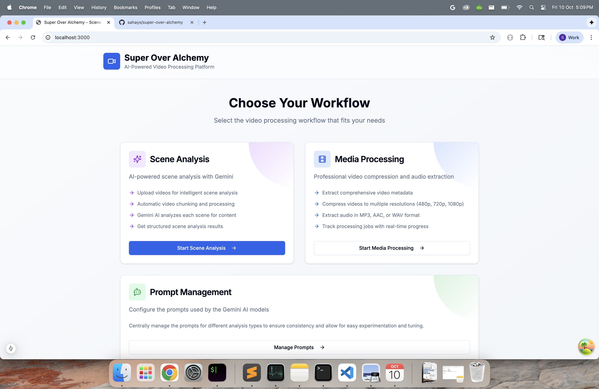
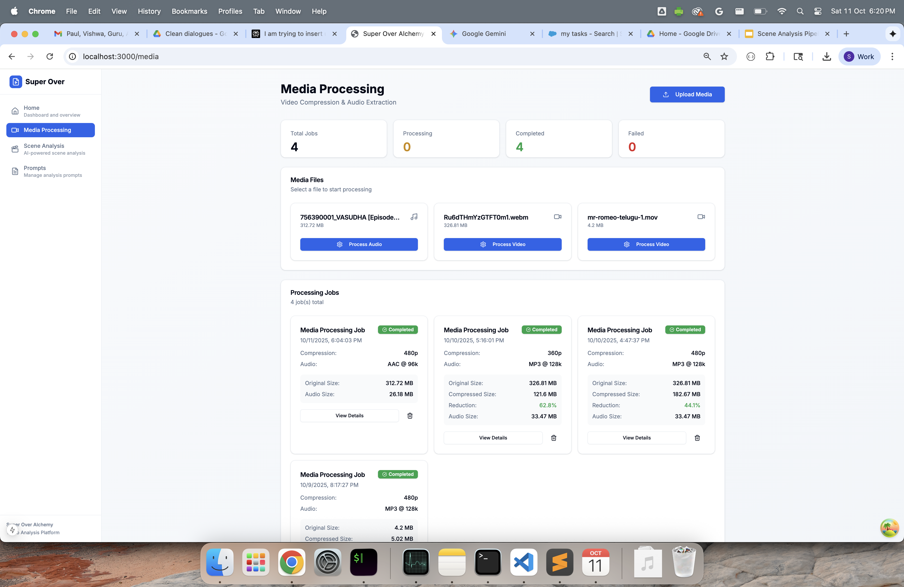
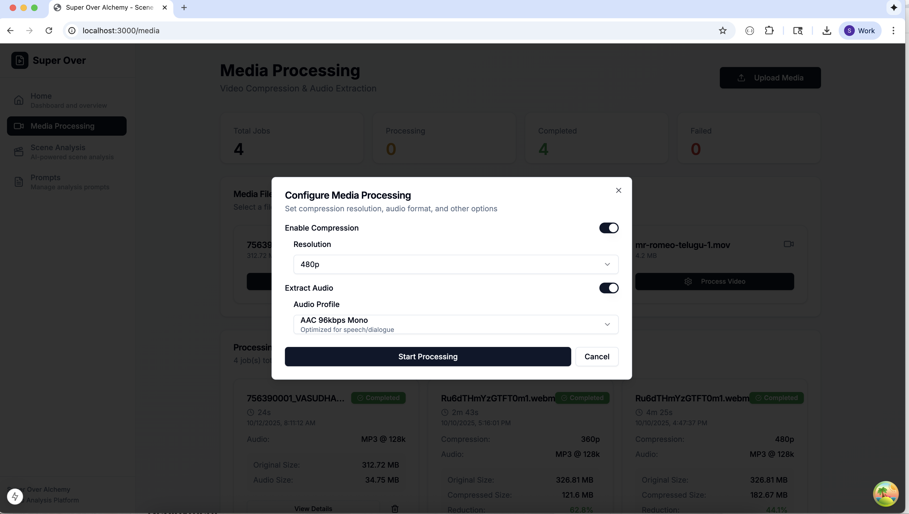
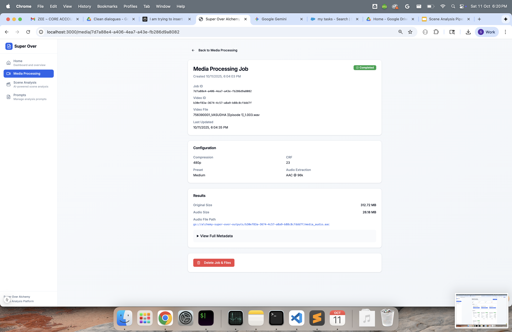
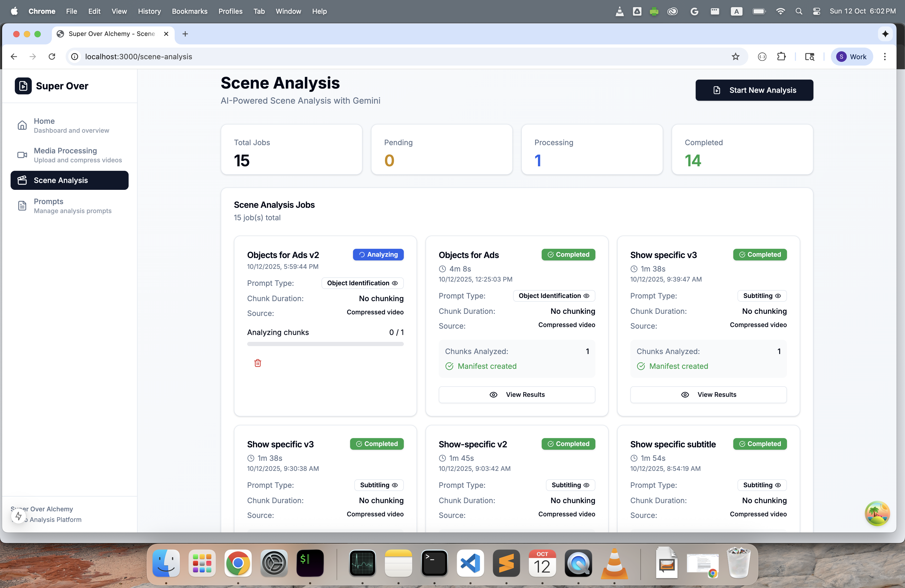
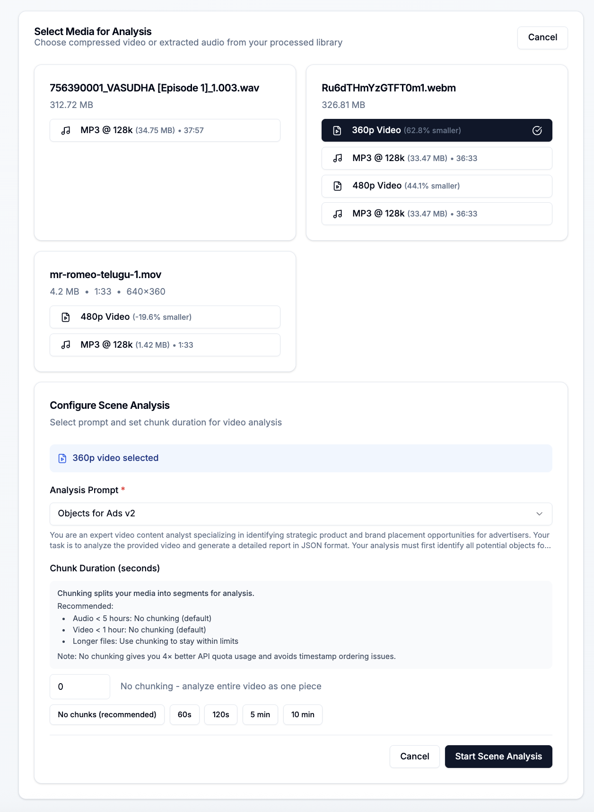
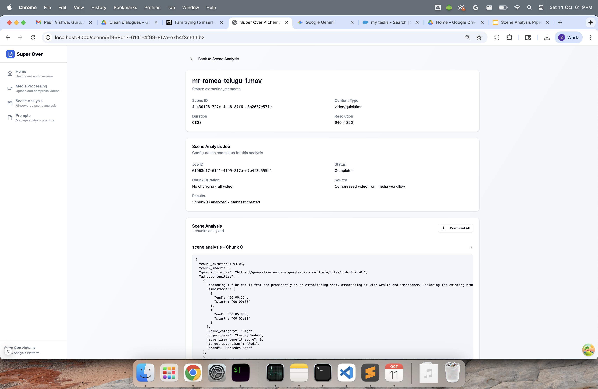
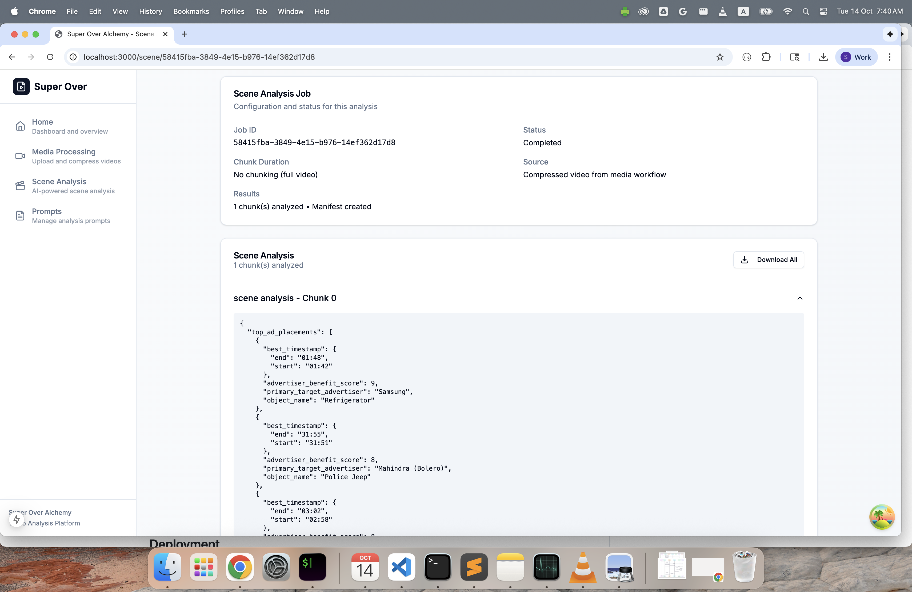
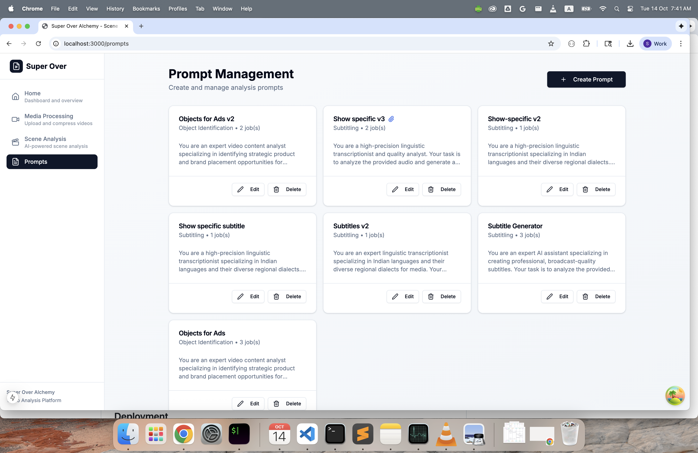
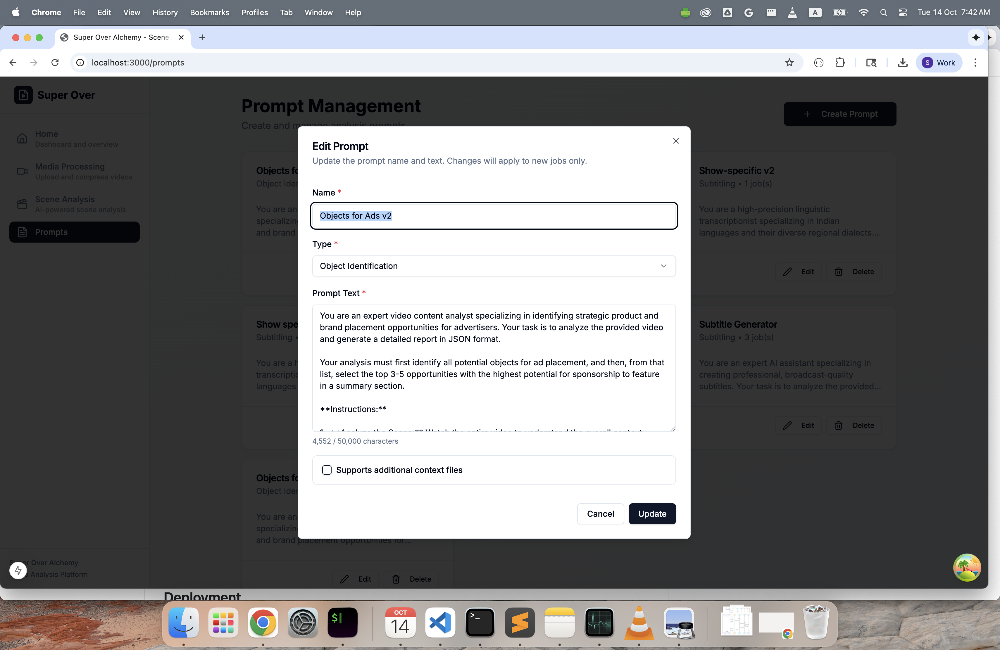

# Super Over Alchemy - Screenshots

Visual guide to the platform's features and workflows.

## Home Dashboard

**Overview and navigation**

- Quick stats: Total jobs, pending, processing, and completed counts
- Four main sections: Home, Media Processing, Scene Analysis, and Prompts
- Clean sidebar navigation for easy access to all features

## Media Processing

### Media Library

**Upload and manage media files**

- View all uploaded videos and audio files
- Track processing status for each media item
- Access detailed job information and results

### Processing Jobs

**Job management interface**

- Configure compression settings (resolution, CRF, preset)
- Set audio extraction options (format, bitrate)
- Monitor job progress with status badges
- View compression ratios and file sizes

### Job Details

**Detailed job information**

- Complete job configuration summary
- Processing results with file paths and metadata
- Original and compressed file sizes
- Option to delete completed jobs

## Scene Analysis

### Analysis Dashboard

**Job tracking and management**

- Total, pending, processing, and completed job counts
- Grid view of all analysis jobs with status badges
- Prompt type and chunk duration for each job
- Quick access to results via "View Results" button

### Start New Analysis

**Configure analysis workflow**

- Pick media from processed library (compressed video or audio)
- Select analysis prompt from pre-configured templates
- Optional context file upload for enhanced accuracy
- Configure chunking strategy (no chunking or fixed duration)

### Analysis Results

**View detailed results**

- Job configuration and status
- Source media information
- Downloadable JSON results with structured data
- Chunk-by-chunk analysis breakdown

**Structured output format**

- Timestamped scene data with start/end times
- Advertiser identification and benefit scores
- Object detection and categorization
- Direct links to reference URLs

### Completed Jobs Overview

**Browse finished analyses**

- Multiple analysis types: Subtitling, Object Identification, Custom prompts
- Chunk processing status and progress
- Manifest creation tracking
- Easy navigation to individual job results

**Additional completed analyses**

- Various prompt types in action
- No-chunking vs. chunked processing strategies
- Compressed video sources highlighted

## Prompt Management

**Create and manage analysis prompts**

- Pre-built templates: Subtitle Generator, Objects for Ads, and more
- Edit or delete existing prompts
- Job usage count for each prompt
- Preview prompt text and configuration

### Prompt Details Modal

**View complete prompt text**

- Full prompt instructions for Gemini AI
- Formatting rules and output specifications
- JSON schema definitions for structured responses
- Context handling and quality guidelines
