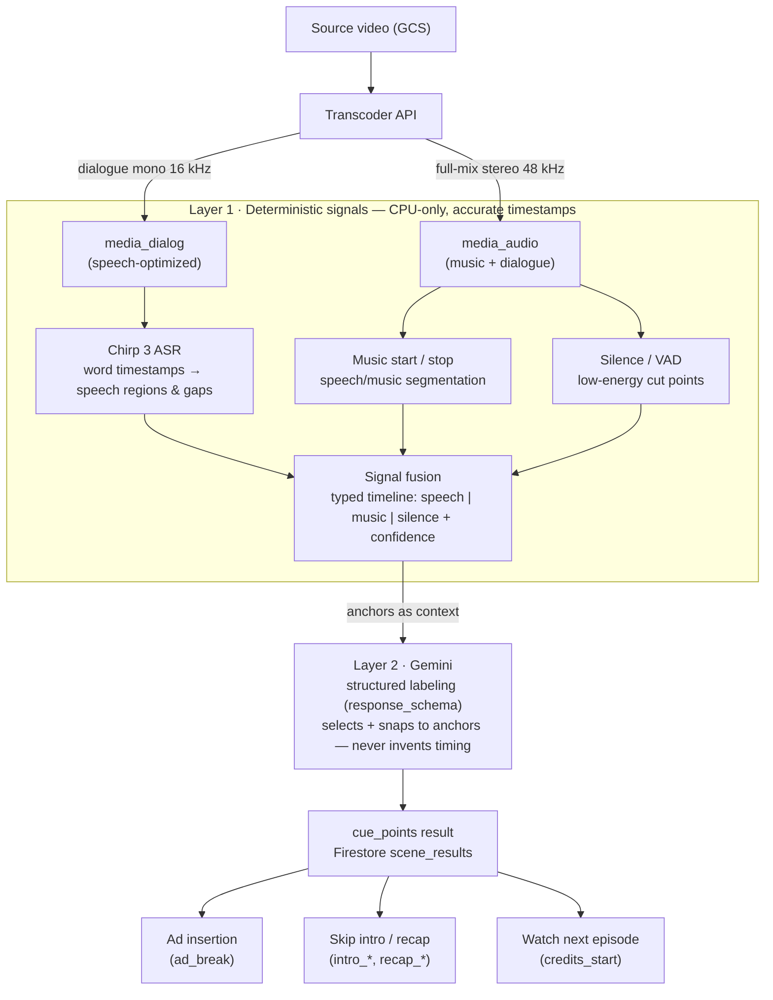

# Cue-Point Detection — ASR + Music/Silence + LLM

Detecting accurate timestamps for **ad insertion, skip-intro, recap, and watch-next / credits** by
fusing deterministic audio signals — Chirp 3 ASR word timing, CPU-only music start/stop, and
silence/VAD — into a typed timeline, then having Gemini label the semantic boundaries. The signals
own the *timestamps*; the LLM owns the *meaning*.

> **Status: proposed design, not yet built.** No cue-point, music-detection, or VAD code exists in
> the repo today, and `requirements.txt` carries **no audio/DSP libraries** (no numpy/scipy/librosa/
> webrtcvad). This doc describes the architecture to build. It **reuses** three things that already
> exist — Chirp 3 ASR (`libs/speech/client.py`), the Transcoder full-mix audio extract
> (`libs/transcoder/builders/media_job_builder.py`), and Gemini structured output
> (`libs/gemini/scene_analyzer.py`) — and adds a net-new **CPU-only signal-analysis layer** in
> between. **Fixed by requirement:** Chirp 3 is the ASR and Gemini is the LLM. Scope is **audio-only**
> (no video shot detection). The music/silence detector is presented as options with a recommended
> default.

## Why one signal isn't enough

A cue point is only useful if its timestamp is right to the frame. No single detector gets there:

- **ASR alone** finds *where speech is*, but a theme song, a silent ad-break, or end credits are
  exactly the places with **no speech** — the detector goes blind precisely where the cue lives.
- **Music detection alone** finds the theme song but can't tell an *intro* theme from a *credits*
  theme from a *recap* montage — those differ by **position and context**, not by audio.
- **An LLM alone** can reason about all of that, but at `temperature=1.0` it will **invent
  plausible-but-wrong timestamps** — the same failure the [subtitle 2-pass pipeline](subtitle-2pass-sequence.md)
  solves by letting Chirp own timing and Gemini own text.

So the design borrows that pipeline's core rule and generalizes it:

> **The LLM never invents a timestamp. It selects and snaps to a deterministic anchor produced by
> the signal layer.**

Accuracy comes from **fusing** cheap, precise signals (speech regions, music segments, silence
gaps) into an anchor set, and using the LLM only to *classify* those anchors into semantic cue
types. Multiple weak signals that agree beat one strong signal that guesses.

## The two layers

| Layer | Owns | Mechanism | Output |
|-------|------|-----------|--------|
| **1 · Deterministic signals** (CPU-only) | *Where* the boundaries are | Chirp ASR + music seg + silence/VAD, fused | Typed timeline of anchors with precise timestamps + confidence |
| **2 · Gemini labeling** (LLM) | *What* each boundary means | Structured output over the anchor timeline (+ optional audio) | `cue_points` — each snapped to an anchor |

This is the direct analogue of the subtitle pipeline's Chirp-timing + Gemini-text split, extended
from one signal (ASR) to three.

## Pipeline diagram


<!-- Renders natively on GitHub. Source of truth: cue-points-detection.mmd -->



## Layer 1 — Deterministic audio signals (CPU-only)

Three detectors run over the extracted audio and are merged into one timeline. All are CPU-only.

### ASR anchors — Chirp 3 (fixed)

Reuse `SpeechTranscriber.transcribe_gcs()` (`libs/speech/client.py:55`), which runs Chirp 3 with
`enable_word_time_offsets=True` and returns **word-level** `{start, end, text}` rows
(`client.py:148-160`). From the word stream, derive **speech regions** (contiguous words) and
**speech gaps** (silences between words) — the gaps are strong cue-boundary candidates. The existing
`format_as_context()` (`client.py:187`) already renders these as `[HH:MM:SS.mmm --> ...] (hint: …)`
lines; the fusion step (below) extends that format to carry music and silence anchors too.

### Music start / stop

Run **speech/music segmentation on the full-mix audio** — `media_audio`, the stereo 48 kHz extract
that still contains music (`libs/transcoder/builders/media_job_builder.py:66-69`). **Do not** use
the dialogue-only `media_dialog` (mono, center channel, 16 kHz — `media_job_builder.py:61-65`): it
is optimized to isolate speech and throws music away, which is the opposite of what this detector
needs. Output: `music` segments `[start, stop]` with a confidence score.

CPU-only options (Chirp/Gemini are fixed; **this** choice is open — recommendation first):

| Detector | Approach | Accuracy | Weight | Notes |
|----------|----------|----------|--------|-------|
| **inaSpeechSegmenter** *(recommended)* | Pretrained CNN, speech/music/noise | High | Heavy — pulls in TensorFlow-CPU | Best accuracy off the shelf; segment-level music/speech boundaries |
| **pyAudioAnalysis** | Classical ML (SVM/kNN over MFCC etc.) | Medium | Light — scikit-learn + numpy | Solid baseline, smaller footprint, older |
| **librosa** feature stack | Hand-rolled (spectral contrast, chroma, RMS, HPSS) | Depends on tuning | Light — numpy/scipy | Building blocks, not a classifier; use to refine or when deps must stay minimal |

Recommendation: **inaSpeechSegmenter** for the accuracy priority, falling back to **pyAudioAnalysis**
if the TensorFlow-CPU dependency is unacceptable (see [Caveats](#caveats--known-issues)).

### Silence / VAD

Silence gaps are where an ad can be inserted with the least disruption, and they sharpen every other
boundary. Detect them frame-by-frame:

| Detector | Approach | Weight | Notes |
|----------|----------|--------|-------|
| **webrtcvad** *(recommended)* | Frame-level voice-activity (10–30 ms frames) | Very light | Fast, battle-tested; precise speech/non-speech edges |
| **silero-vad** | Small neural VAD | Adds torch | Higher accuracy in noise; heavier |
| **librosa RMS / auditok** | Energy-threshold segmentation | Light | Backup for pure silence detection |

Frame-level VAD gives **sub-frame** cut points — the difference between an ad splice landing on a
clean silence versus mid-word.

### Signal fusion

Merge the three detectors into a single ordered timeline of typed, IDed anchors. Each anchor is
`{id, start, end, type ∈ speech|music|silence, confidence}` (speech anchors also carry the ASR
hint). This is the *anchor set* — the only source of timestamps in the whole system:

```text
=== SIGNAL TIMELINE (anchors) ===
sil-3   [00:00:41.200 --> 00:00:41.800]  silence  conf=0.99
mus-4   [00:00:42.400 --> 00:01:13.100]  music    conf=0.93
spk-5   [00:01:13.400 --> 00:03:02.900]  speech   conf=0.97  (hint: "So, where were we...")
...
sil-27  [00:10:11.300 --> 00:10:12.700]  silence  conf=0.98
```

Fusion rules resolve overlaps (music under dialogue → both tagged; music with no speech → pure
music) and record where signals **agree** — agreement is the confidence input the LLM and the
thresholds below rely on.

### Audio source & decoding

- **Music/silence detectors** consume the full-mix `media_audio` (48 kHz); **ASR** consumes
  `media_dialog` (16 kHz). Both already come out of one Transcoder media job.
- **Decode step (net-new):** the Transcoder emits **AAC in an m4a/mp4 container**
  (`media_job_builder.py:84-86`), but the CPU DSP libs want **PCM/WAV**. Either add a WAV/PCM audio
  output to the media job config, or decode on the worker with `soundfile` / `audioread`. This is a
  real integration point, not a detail — flag it early.

## Layer 2 — Gemini semantic labeling

Feed the fused anchor timeline (rendered like `format_as_context`) as context — and optionally the
audio itself as a media Part — into `SceneAnalyzer.analyze_chunk()`
(`libs/gemini/scene_analyzer.py:45`) with a cue-points `response_schema`. Structured output is
requested exactly as the scene pipeline already does it (`scene_analyzer.py:99-105`):

```python
gen_config_kwargs["response_mime_type"] = "application/json"
gen_config_kwargs["response_schema"] = response_schema   # a Gemini-compatible JSON-Schema dict
```

The prompt instructs Gemini to **classify anchors, not create timestamps**: every cue must reference
an `anchor_id` from the timeline, and its `start_sec` must equal that anchor's boundary.

Cue-points `response_schema` (the shape Gemini must return):

```json
{
  "type": "object",
  "properties": {
    "cue_points": {
      "type": "array",
      "items": {
        "type": "object",
        "properties": {
          "type": { "type": "string",
            "enum": ["content_start", "recap_start", "recap_end",
                     "intro_start", "intro_end", "ad_break",
                     "credits_start", "content_end"] },
          "anchor_id":  { "type": "string" },
          "start_sec":  { "type": "number" },
          "end_sec":    { "type": "number" },
          "confidence": { "type": "number", "minimum": 0, "maximum": 1 },
          "evidence":   { "type": "string" }
        },
        "required": ["type", "anchor_id", "start_sec", "confidence"]
      }
    }
  },
  "required": ["cue_points"]
}
```

Example output for one episode head:

```json
{
  "cue_points": [
    { "type": "recap_end",    "anchor_id": "sil-3",  "start_sec": 41.8, "confidence": 0.86,
      "evidence": "'previously on' narration ends; recap montage music stops at a 0.6s silence" },
    { "type": "intro_start",  "anchor_id": "mus-4",  "start_sec": 42.4, "confidence": 0.94,
      "evidence": "theme-song music starts with no speech" },
    { "type": "intro_end",    "anchor_id": "mus-4",  "start_sec": 73.1, "confidence": 0.94,
      "evidence": "theme music ends and dialogue resumes" },
    { "type": "ad_break",     "anchor_id": "sil-27", "start_sec": 612.0, "confidence": 0.71,
      "evidence": "1.4s silence at a scene change with no active dialogue — low-disruption splice" }
  ]
}
```

Because `start_sec` is copied from the referenced anchor, cue accuracy is the **signal layer's**
accuracy, not the LLM's — the LLM only has to pick the right anchor and the right label.

## Cue types & use cases

| Cue type | Signal fingerprint | Product use |
|----------|--------------------|-------------|
| `content_start` / `content_end` | First/last speech or music after/before leader/trailer | Program bounds, trim |
| `recap_start` / `recap_end` | Montage music + narration at the head ("previously on") | Skip recap |
| `intro_start` / `intro_end` | Theme-song music segment, little/no dialogue | **Skip intro** |
| `ad_break` (candidates) | Silence + scene change + speech gap, ranked by low disruption | **Ad insertion** (SCTE-35-like markers) |
| `credits_start` | Music resumes + dialogue drops, near the tail | **Watch next episode** card |

## Accuracy techniques

Accuracy is the whole point, so the design leans on it at every step:

- **Snap-to-signal.** The LLM emits an `anchor_id`; the timestamp is the anchor's, never the model's
  free guess. Sub-second precision comes from the detectors, not the language model.
- **Multi-signal agreement.** Prefer cues where detectors corroborate (e.g. music-start *and* a
  preceding silence). Agreement raises confidence; conflict lowers it.
- **Confidence thresholds → review.** Emit cues above a confidence gate; route borderline cues to a
  human-review queue rather than shipping a wrong splice.
- **Cross-episode priors (series).** Intros and credits recur at **stable offsets** across a series;
  a per-series prior turns a noisy single-episode guess into a high-confidence detection and catches
  outliers.
- **Frame-level VAD** for the exact cut, so an ad splice lands on clean silence, not mid-word.
- **Tolerance windows.** Score cues against a golden set with a timing tolerance rather than exact
  equality (temp=1.0 and detector jitter make exact-match meaningless).

Measuring all of this is exactly what the [evaluation ladder](evaluation-strategy.md) is for: build
**golden cue sets** (episodes with human-marked cue timestamps), use **timing IoU / offset** as the
WER-analogue for Rung 1, and track **precision/recall per cue type** — a missed `intro_end` and a
false `ad_break` are different failures with different costs.

## Integration — how it slots in

The feature plugs into the existing scene pipeline rather than forking it:

- **New mode.** Add `prompt_type = "cue_points"` and extend the `use_chirp`-style gate
  (`libs/scene_processing/sequential.py:62`, `libs/scene_processing/parallel.py:239`) so the mode
  triggers ASR **and** the new music/silence detectors, then feeds the fused timeline to Gemini as
  context — the same "prepend anchors, then analyze" flow subtitling already uses. No factory change.
- **Signal step.** Insert the Layer-1 detectors as a worker step between audio extraction and the
  Gemini call (a new module, e.g. `libs/audio_signals/`), reusing the extracted `media_audio` /
  `media_dialog` paths already tracked on the media job.
- **Persistence.** Save with `db.save_result(video_id, result_type="cue_points", result_data=…,
  scene_job_id=…)` (`libs/db/scenes.py:39`). The job/status model is unchanged — `SceneJobStatus`
  (`libs/db/enums.py:16-23`) and the free-form `results.step` strings already cover a new sub-step
  (e.g. `"detecting_signals"`).
- **Consumers.** Emit cues as `{start_sec, end_sec, label, kind}` so they align with the existing
  engagement readers in `libs/engagement/scene_extract.py`, and with player/ad-server integrations.

## Tools & dependencies

| Role | Tool / Service | Dependency |
|------|----------------|------------|
| ASR anchors (fixed) | Google Cloud Speech-to-Text v2, `chirp_3` | `google-cloud-speech` *(already present)* |
| Audio extraction | Transcoder API (full-mix + dialog) | `google-cloud-video-transcoder` *(already present)* |
| Semantic labeling (fixed) | Gemini `gemini-3.1-pro-preview` via Vertex AI | `google-genai` *(already present)* |
| Music / speech segmentation | inaSpeechSegmenter *(recommended)* / pyAudioAnalysis | **net-new** |
| Silence / VAD | webrtcvad *(recommended)* / silero-vad | **net-new** |
| DSP + audio decode | numpy, scipy, librosa, soundfile / audioread | **net-new** |

**Not used:** no GPU (CPU-only by requirement); no audio **source separation** (Demucs/Spleeter — too
heavy, and not needed for start/stop detection); no managed ad-marker/SCTE-35 service; no **video
shot detection** (audio-only by scope).

### New CPU-only dependencies (net-new)

The repo today ships **zero** audio/DSP libraries — all media work is delegated to managed Google
Cloud services. This feature is the first to add a local numeric stack (numpy/scipy + a detector
lib). That is a deliberate trade-off, called out in the caveats below; keep the footprint minimal
and pinned.

### Relevant config (`config.py`)

Existing settings to reuse:

| Setting | Default | Line |
|---------|---------|------|
| `chirp_model` | `"chirp_3"` | 92 |
| `chirp_language` | `"auto"` | 93 |
| `gemini_default_model` | `"gemini-3.1-pro-preview"` | 30 |
| `gemini_temperature` | `1.0` | 32 |
| `chunk_duration_seconds` | `30` | 87 |
| `scene_processing_mode` | `"sequential"` | 104 |

Proposed new settings (build later): `cue_points_min_confidence` (review gate, e.g. `0.6`),
`music_min_segment_sec` (ignore music blips shorter than N seconds), and the chosen detector's model
name / VAD aggressiveness.

## Caveats & known issues

- **No source separation.** `media_audio` is the mixed track; music *under* dialogue is harder to
  bound than music alone. `media_dialog` is speech-isolated but discards music, so it can't help
  here. Accept mixed-audio detection, or add a (heavy) separation step later.
- **Decode-to-WAV is required.** The Transcoder emits AAC/m4a; CPU DSP libs want PCM/WAV
  (`media_job_builder.py:84-86`). Add a WAV output or decode on the worker — don't discover this at
  build time.
- **Heavy deps vs the repo's philosophy.** The codebase deliberately runs **no local DSP** — "all
  media work goes through the managed Transcoder API." inaSpeechSegmenter (TensorFlow-CPU) and
  silero-vad (torch) each add hundreds of MB to the worker image and cut against that principle. If
  image size or cold-start matters, prefer the pyAudioAnalysis + webrtcvad + librosa stack and accept
  a slightly lower accuracy ceiling.
- **Cross-episode priors need series metadata.** The strongest accuracy lever (recurring intro/
  credits offsets) only works when episodes are linked to a series — that linkage must exist upstream.
- **LLM cost & non-determinism.** Layer 2 spends Gemini tokens per chunk at `temperature=1.0`;
  budget for it, and evaluate with multiple seeds (see the [eval doc](evaluation-strategy.md)).

---

*Proposed design. Reuses `libs/speech/client.py` (Chirp ASR), `libs/transcoder/builders/media_job_builder.py`
(audio extraction), and `libs/gemini/scene_analyzer.py` (structured output); the CPU-only signal
layer is net-new. Update this doc — and drop the "not yet built" banner — once the pipeline lands.*
