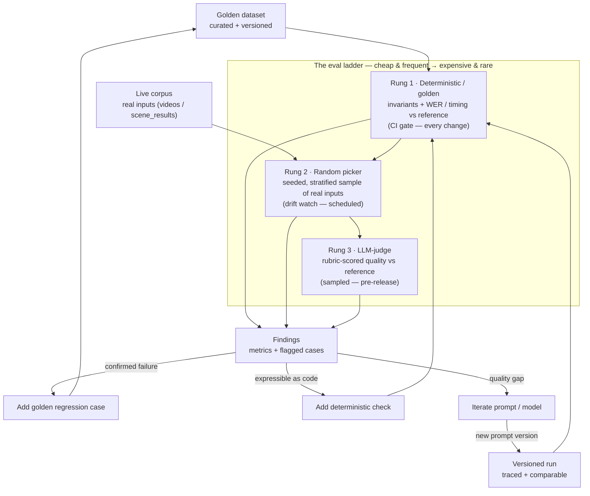

# Evaluating Subtitle / LLM Outputs — Best Practices

> **Status: best-practice reference, not yet built.** Super Over Alchemy has no eval harness
> today. This doc documents *how we should* evaluate the LLM outputs of this pipeline — the
> methodology to adopt and the data model to grow into. The tooling described under "recommended
> target design" is **to be built later**; nothing here claims to already exist. Worked example
> throughout is the [2-pass subtitle pipeline](subtitle-2pass-sequence.md); the same ladder
> generalizes to scene analysis and image adapts.

## Why evals here

The subtitle/transcription output is produced by Gemini at `temperature=1.0` (`config.py:32`) —
**non-deterministic** — from a prompt that is **user-authored and mutated in place** with no
version history (`libs/db/prompts.py:89-136` overwrites `prompt_text`). So today:

- A prompt edit or a model bump can **silently regress** subtitle quality — wrong timing,
  mistranslation, dropped speech — and nothing catches it.
- After a prompt or `settings` change, you often **can't reproduce or attribute** an output,
  because the candidate model isn't stamped on the run (it's read from global `settings` at
  execution, `config.py:30`).

Evals fix both: a **repeatable quality signal** you can gate on, and **traceability** so every
output ties back to the exact prompt version + model + config that produced it.

**What "good" looks like:** cheap deterministic checks gate every change; a periodic sample
catches drift; an LLM-judge grades the subjective quality no assertion can; every run is
fingerprinted and comparable; and every real failure becomes a permanent regression test.

## The eval ladder

Three rungs, ordered **cheap + frequent → expensive + rare**. Gate on the cheap rungs; sample on
the expensive ones. A change must clear Rung 1 before Rung 3 is worth spending tokens on.

| Rung | Question it answers | Mechanism | Cost | Cadence |
|------|--------------------|-----------|------|---------|
| **1 · Deterministic / golden** | "Is it structurally valid and close to a known reference?" | Code assertions + metrics vs golden reference | ~free | Every change (CI gate) |
| **2 · Random picker** | "Does it still hold up on real, unlabeled inputs?" | Seeded stratified sample → Rung-1 checks + review queue | low | Scheduled (nightly/weekly) |
| **3 · LLM-judge** | "Is the *quality* good — faithful, readable, well-translated?" | Rubric-scored by an independent judge model | tokens | Sampled, pre-release |


<!-- Renders natively on GitHub. Source of truth: evaluation-strategy.mmd -->



### Rung 1 — Deterministic / golden dataset

Fixed, curated inputs with machine-checkable expectations. Two kinds of checks:

- **Invariants (pure pass/fail — a failure is a bug, block the change):**
  - Output parses as valid SRT; cue timestamps are **monotonic and non-overlapping**.
  - Every cue falls **within the chunk/video bounds** (catches Gemini inventing timings — Chirp's
    role is precisely to anchor these; see the subtitle doc).
  - No empty cues; cue count is within a sane band for the clip's speech density.
  - **Reading speed** (characters-per-second) under a cap (~17–21 CPS) so subtitles are humanly
    readable.
  - For structured prompts (scene analysis), the JSON validates against the response schema.
- **Golden metrics (scored vs a reference, thresholded — *not* exact-string match, which is
  futile at temp=1.0):**
  - **WER / CER** against a golden human transcript (transcription accuracy).
  - **Timing offset / overlap (IoU)** of cues vs golden cue boundaries.
  - **Detected-language** matches the expected language.

This rung is fast and essentially free (pure code over stored outputs; it only spends API tokens
if you regenerate outputs). It is the **CI gate**.

**In practice.** A golden case is a versioned manifest entry plus a human-verified reference file;
the clip lives under a dedicated GCS eval prefix (paths below are the recommended layout — build
later):

```yaml
# evals/datasets/subtitles/manifest.yaml
version: 2026-07-07.1
cases:
  - id: sub-es-clean-001
    description: Clean single-speaker Spanish news read, no music
    input:
      gcs_uri: gs://superover-evals/subtitles/sub-es-clean-001.mp4
      language: es
      duration_s: 42.5
    prompt_type: subtitling            # gates the 2-pass Chirp + Gemini path
    difficulty: easy
    tags: [single-speaker, news, non-english]
    expected:
      detected_language: es
      reference: golden/sub-es-clean-001.srt   # the answer key
      max_wer: 0.08
      max_timing_offset_s: 0.30
```

The reference it scores against (`golden/sub-es-clean-001.srt`):

```srt
1
00:00:00,300 --> 00:00:03,120
Buenas noches, bienvenidos al informativo de las nueve.

2
00:00:03,400 --> 00:00:06,900
Comenzamos con la última hora desde el parlamento.
```

The check parses the candidate output — the timestamped transcript in
`scene_results.result_data.raw_text`, the same content the client renders to SRT — asserts the
invariants, then scores against the reference:

```python
# invariants — a failure is a bug; block the change
cues = parse_cues(candidate_raw_text)          # adapts to the prompt's output format
assert cues, "no cues produced"
for a, b in zip(cues, cues[1:]):
    assert a.end <= b.start                                  # monotonic, non-overlapping
for c in cues:
    assert 0 <= c.start and c.end <= case.duration_s         # within clip bounds
    assert len(c.text) / (c.end - c.start) <= 21             # readable (chars/sec cap)

# golden metrics — thresholded, NOT exact-string match (futile at temp=1.0)
assert detect_language(candidate_text) == case.expected.detected_language
assert jiwer.wer(reference_text, candidate_text) <= case.expected.max_wer
assert max_cue_offset(cues, reference_cues)      <= case.expected.max_timing_offset_s
```

(The exact `raw_text` shape depends on the user-authored prompt, so `parse_cues` normalizes it;
see the [subtitle doc](subtitle-2pass-sequence.md).)

### Rung 2 — Random picker

Deterministic golden sets are small and go stale; the long tail lives in production. Rung 2
**samples real inputs** — a seeded, **stratified** draw (by language, duration, genre) from
`videos` / `scene_results` so rare buckets aren't missed — runs the pipeline, applies the Rung-1
checks, and queues results for review.

- Purpose: measure pass-rate on **unlabeled real data** and catch **drift** the curated set
  misses.
- Seed the sampler so a run is reproducible; log which cases were drawn.
- There's no golden answer here, so correctness can't be scored deterministically — pair it with
  Rung 3 for quality, and **promote every confirmed failure into the Rung-1 golden set** (the
  ratchet).

**In practice.** The picker records its seed and the exact draw so the run reproduces, applies the
Rung-1 *invariants* (no reference, so no WER), and files anything that fails for review:

```jsonc
// the draw — reproducible from (seed, corpus snapshot)
{
  "eval_run_id": "rung2-2026-07-07",
  "seed": 20260707,
  "stratify_by": ["language", "duration_bucket"],
  "drawn": [
    { "video_id": "v_9f2a", "language": "hi", "duration_s": 118.2, "bucket": "60-180s" },
    { "video_id": "v_1c07", "language": "en", "duration_s": 22.9, "bucket": "0-60s"   }
  ]
}
```

```jsonc
// per-case result on an unlabeled REAL input — invariants only
{
  "video_id": "v_9f2a",
  "checks": { "valid_srt": true, "monotonic_cues": true,
              "within_bounds": false, "reading_speed_ok": true },
  "verdict": "flag",
  "flags": ["last_cue_end_exceeds_clip_by_1.8s"],   // Gemini invented timing past the audio
  "review_status": "pending"                         // → confirm → promote to a Rung-1 golden case
}
```

The drift this catches: `within_bounds` fails on a real Hindi clip the small curated set never
covered — exactly the long tail Rung 2 exists to surface, now on its way to becoming a permanent
Rung-1 case.

### Rung 3 — LLM-judge

For the qualities code can't check — **transcription faithfulness, translation quality,
punctuation/readability, speaker attribution, naturalness**.

- **Reference-based judging** (give the judge the audio and/or the golden transcript to grade
  against) is far more reliable than reference-free "does this look good."
- Use an explicit **rubric**: per-criterion score (1–5 or pass/fail) **with a required
  rationale**, returned as schema-constrained JSON (the same structured-output mechanism as
  `SceneAnalyzer`).
- **Independent, pinned judge model.** `gemini-3.5-flash` (`config.py:79`) is a ready, cheap
  candidate; use a different model from the candidate under test to cut **self-preference bias**,
  pin its version, and run it at low temperature for stability.
- **Calibrate before you trust it:** measure judge-vs-human agreement on a labeled sample and
  track it over time. Mitigate known biases (position bias → randomize order in pairwise
  comparisons; verbosity bias → cap on length).
- **Sample, don't judge everything** — it costs tokens. Use judge output for *trends and
  flagging*, not as a single-case oracle.

**In practice.** The judge is a pinned model (`gemini-3.5-flash`, distinct from the candidate)
called through the **same structured-output mechanism as `SceneAnalyzer`** — a rubric prompt plus
a `response_schema`, run at low temperature. It grades *reference-based*: it gets the golden
transcript (and optionally the audio) to score against.

Rubric schema (the judge must return exactly this):

```json
{
  "type": "object",
  "properties": {
    "transcription_faithfulness": { "type": "integer", "minimum": 1, "maximum": 5 },
    "translation_quality":        { "type": "integer", "minimum": 1, "maximum": 5 },
    "readability":                { "type": "integer", "minimum": 1, "maximum": 5 },
    "timing_sync":                { "type": "integer", "minimum": 1, "maximum": 5 },
    "rationale": { "type": "string" },
    "verdict":   { "type": "string", "enum": ["pass", "fail", "flag"] }
  },
  "required": ["transcription_faithfulness", "translation_quality",
               "readability", "timing_sync", "rationale", "verdict"]
}
```

Judge prompt (reference-based, bias-aware):

```text
You are grading subtitles for accuracy and readability, NOT length.
Source language: es. Target: es.

REFERENCE (human-verified):
<contents of golden/sub-es-clean-001.srt>

CANDIDATE (under test):
<candidate raw_text>

Score each criterion 1–5 against the reference and give a one-sentence rationale that
cites a specific cue. Do not reward verbosity. Return JSON matching the schema.
```

Example verdict for `sub-es-clean-001`:

```json
{
  "transcription_faithfulness": 5,
  "translation_quality": 4,
  "readability": 3,
  "timing_sync": 5,
  "rationale": "Text matches the reference, but cues 4 and 7 exceed ~21 CPS and read too fast.",
  "verdict": "flag"
}
```

The `readability: 3` + `flag` is the actionable signal: if it recurs across cases, encode it as a
deterministic chars-per-second check in Rung 1 (cheaper, permanent) — that's the loop closed in
"Iterating & using the findings" below.

## Dataset design — what to include

Small, diverse, and **versioned**. Aim for **20–50 curated cases** to start:

- **Happy path** — clean single-speaker speech in the common languages.
- **Edge cases** — silence / music-only segments, overlapping speakers, code-switching /
  multilingual, fast speech, long pauses, numbers & proper nouns, profanity.
- **Regression cases** — every real bug becomes a permanent case so it can't come back.

Each case: the input clip (in a **dedicated GCS eval prefix**) + metadata (language, duration,
difficulty, tags) + expected properties / golden transcript + a one-line rationale. Keep the
**manifest in the repo** (YAML/JSON) under version control; treat each case as **immutable and
IDed**. Grow the set by ratchet, not by rewriting.

## What to expect

- **Thresholds are two kinds:** a **gate** (blocks the change — e.g. any invariant failure, WER
  above ceiling) vs a **guardrail** (alerts but doesn't block — e.g. judge mean dipping).
- Expect **~100% on invariants** (anything less is a real bug), a **WER trend with a ceiling**,
  and a **judge score distribution** — report the mean *and* the %-below-threshold, not just an
  average.
- **Expect noise.** At temp=1.0 a single run is a sample: run **multiple seeds**, report
  **confidence intervals**, and don't chase single-run deltas.
- **The judge is imperfect** — treat its agreement with humans as a metric you monitor, not a
  given.

## Iterating & using the findings

1. **Triage** failures by rung and category (timing vs transcription vs translation vs format).
2. **A/B a change** (new prompt version or model): run the whole ladder on old vs new and compare
   aggregate **and** per-case. Ship only if there are **no golden regressions** *and* the target
   metric **beats the noise band**.
3. **Close the loop:** a judge-found issue that can be expressed in code becomes a **deterministic
   Rung-1 check** (cheaper, permanent); a random-picker failure becomes a **golden case**.
4. **Track trends over time** keyed by **(prompt version, model)** so quality is attributable to a
   specific change.

## Tracing outputs & flagging — versioned prompts, runs

Evals are only actionable if every output is traceable to what produced it. Here's the current
substrate and the gaps to close.

### What already exists (reuse it)

- **Run record:** creating a scene job **snapshots the exact `prompt_text`** alongside
  `prompt_id`, `prompt_type`, `config`, and `response_schema` on the `scene_jobs` doc
  (`libs/db/scenes.py:105-137`). So the prompt *text* at run time is already frozen per run, even
  though the prompt library entry can later change.
- **Output record:** `scene_results` links back to its run via `scene_job_id` and carries the
  output plus `token_usage` and `finish_reason` in `result_data` (`libs/db/scenes.py:39-79`);
  fetch with `get_results_for_job(scene_job_id)`.
- **Cost:** token cost is already computed per call (`libs/gemini/common.py`).

### Gaps to close (build later)

| Gap | Today | Why it matters |
|-----|-------|----------------|
| **No prompt versioning** | `update_prompt` overwrites `prompt_text` in place; no `version`, no history, no hash (`libs/db/prompts.py:89-136`) | Can't say "prompt X v5", can't group/compare runs by prompt version |
| **Model not stamped on the run** | Candidate model read from global `settings` at execution (`config.py:30`), not stored per job | An output can't be reproduced or attributed after a settings/model change |
| **No dedicated eval records** | Only production `scene_jobs` / `scene_results` exist | Overloading them with eval verdicts/flags pollutes prod data |
| **No verdict / flag** | — | No structured way to mark a case pass/fail/flag or route it to human review |

### Recommended target design (build later)

- **Versioned prompts** — add a monotonic `version` and a `content_hash` (sha256 of
  `prompt_text`); write an **immutable snapshot** per version instead of overwriting. Now every
  run can reference `(prompt_id, version, hash)`.
- **Run provenance** — stamp `candidate_model` (+ its pinned id), `temperature`,
  `chunk_duration`, `chirp_model`, and `git_sha` onto each run.
- **Eval collections** — lightweight `eval_runs` (dataset_version, prompt version/hash, candidate
  & judge models, config snapshot, aggregate metrics) and `eval_case_results` (per-case
  deterministic metrics, judge scores + rationale, `verdict` ∈ pass/fail/flag, `flags[]`, human
  review status; link the real `scene_job_id` when a case is run through the live pipeline).
- **Reproducibility fingerprint** — the tuple **(dataset_version, prompt_version|hash,
  candidate_model, judge_model, config, git_sha)** uniquely identifies a run, making results
  comparable and reproducible. Consider running the deterministic rung at **temp=0** to cut
  variance, while noting production uses temp=1.0.

## Where it would live (build later — guidance, not a task)

- An **`evals/`** directory: `datasets/<task>/manifest.yaml` (versioned cases), `harness/` (the
  runner + rung implementations), `judges/` (rubrics).
- **Rung 1 under a pytest `eval` marker** (extend the existing markers in `pyproject`/`run_tests.sh`)
  so it can gate CI on stored outputs.
- **Rungs 2–3 as an on-demand / nightly CLI** — they need GCP credentials and spend tokens, so
  they don't belong in the unit-test CI path.
- **Reuse the existing singletons** (`get_db()`, the `SceneAnalyzer`) rather than reimplementing
  the pipeline in the harness.

---

*Grounding: `libs/db/prompts.py`, `libs/db/scenes.py`, `config.py`. Worked example:
[subtitle-2pass-sequence.md](subtitle-2pass-sequence.md). Update this doc as the eval tooling
gets built.*
