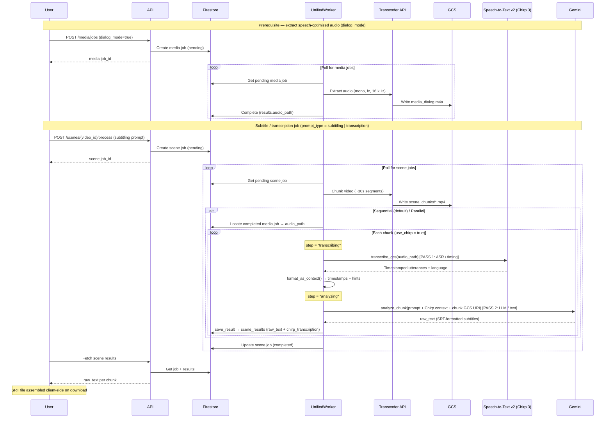

# Subtitle 2-Pass Pipeline — ASR + LLM

How Super Over Alchemy generates subtitles and transcriptions using a **two-pass method**:
Google Cloud Speech-to-Text v2 (Chirp 3) for accurate timing, then Gemini to listen to the
audio and produce the final subtitle text.

> **Not a standalone subsystem.** Subtitling is a *mode* of the scene-analysis pipeline. It
> activates when a job runs a prompt whose `type` is `"subtitling"` or `"transcription"` and
> a Speech-to-Text client is available — see the `use_chirp` gate in
> `libs/scene_processing/sequential.py:62` (and `parallel.py:239`). For everything else, the
> same pipeline runs Gemini alone.

## The two passes

| Pass | Purpose | Tool | Produces |
|------|---------|------|----------|
| **1 — ASR** | Accurate **timing anchors** | Google Cloud Speech-to-Text v2, model `chirp_3` | Timestamped words/utterances → a `SPEECH TIMESTAMPS + HINTS` context block |
| **2 — LLM** | The **actual subtitle text** | Gemini `gemini-3.1-pro-preview` (Vertex AI) | Free-text `raw_text` (SRT-formatted) |

The design intent is stated verbatim at `libs/speech/client.py:4-5`: *"Chirp provides timing,
Gemini listens to the audio and generates the actual subtitle text."* Chirp's raw transcript
is passed to Gemini only as approximate **hints** — Gemini is explicitly told the timestamps
are accurate but the hint text may be wrong and it should re-listen to the audio for the
correct transcription/translation (`libs/speech/client.py:200-203`).

## Sequence diagram


<!-- Renders natively on GitHub. Source of truth: subtitle-2pass-sequence.mmd -->



## End-to-end flow

```
POST /media/jobs (dialog_mode=true) ─► Worker ─► Transcoder ─► audio_path saved to processed_bucket
POST /scenes/{video_id}/process (subtitling prompt) ─► db.create_scene_job (PENDING)
Worker._poll_cycle ─► _process_scene ─► SceneOrchestrator.run
   ├─ _resolve_chunks                       (Transcoder splits video into ~30s GCS chunks)
   └─ SceneProcessor.process_chunks         [factory picks Sequential | Parallel]
        ├─ find extracted audio_path from completed media jobs   (sequential.py:69-75)
        ├─ Chirp: transcribe_gcs(audio) ─► format_as_context()   ← PASS 1  (client.py:55,187)
        ├─ context = chirp_text + user_context                    (sequential.py:112)
        └─ Gemini: analyze_chunk(prompt + chirp_context + chunk-GCS-URI)  ← PASS 2  (scene_analyzer.py:45)
             └─ db.save_result(result_type="scene_analysis", {raw_text, chirp_transcription, ...})
```

## Pass 1 — Chirp 3 ASR (timing anchors)

Implemented by `SpeechTranscriber` in `libs/speech/client.py`.

- **Service / model:** Google Cloud Speech-to-Text **v2**, model `settings.chirp_model`
  (`"chirp_3"`). Chirp 3 requires a **regional** endpoint, so the client targets
  `{gcp_region}-speech.googleapis.com` (`client.py:44-53`).
- **Call:** `transcribe_gcs(gcs_uri, language="auto")` → `batch_recognize` with
  `enable_automatic_punctuation=True` and `enable_word_time_offsets=True`; waits up to 600 s
  (`client.py:55-96`).
- **Input:** a GCS URI. The pipeline prefers the **extracted audio** (`media_dialog.m4a`)
  discovered from a completed media job's `results.audio_path`, falling back to the raw video
  chunk (`sequential.py:66-75`, `sequential.py:103`).
- **Output:** `{"utterances": [{start, end, text, type}], "detected_language": str}` — word-
  level timestamps when available, otherwise utterance-level (`_parse_batch_response`,
  `client.py:105-185`).
- **Context handoff:** `format_as_context()` renders the utterances into a text block that is
  prepended to the Gemini prompt (`client.py:187-247`):

  ```
  === SPEECH TIMESTAMPS + HINTS (Chirp 3) ===
  Below are speech timing anchors with raw STT hints.
  Timestamps are accurate — use them for subtitle cue placement.
  Hints are approximate and may be inaccurate — listen to the audio
  for the correct transcription and translation.

  [00:00:01.240 --> 00:00:05.980] (hint: <raw STT text>)
  ...
  ```

If Chirp returns nothing, the chunk fails loudly with a message to ensure an extracted audio
file (not raw video) is available (`sequential.py:107-111`).

## Pass 2 — Gemini refinement (subtitle text)

Implemented by `SceneAnalyzer.analyze_chunk()` in `libs/gemini/scene_analyzer.py:45`.

- **Model / backend:** `gemini-3.1-pro-preview` via **Vertex AI**, using the `google-genai`
  SDK with ADC auth (`scene_analyzer.py:36-41`, `config.py:30`).
- **How the passes combine** (`scene_analyzer.py:78-94`): the Chirp block is concatenated
  onto the prompt (`prompt_text + "\n\n" + context_text`), and the media chunk is attached as
  a `types.Part.from_uri(gcs_path)` — so Gemini reads audio+video **directly from GCS** and
  re-listens rather than trusting Chirp's text.
- **Output shape:** subtitling prompts are free-text (no `response_schema`), so results come
  back as `{"raw_text": ...}`. A MAX_TOKENS **continuation loop** (up to 5 continuations)
  stitches long outputs together (`scene_analyzer.py:116-193`).
- **The prompt itself is user-authored.** Only `prompt_type` selects the Chirp path; the
  actual SRT-formatting/translation instructions live in a Firestore prompt record, **not in
  source control** (see Caveats).

## Orchestration

- **Trigger:** `POST /scenes/{video_id}/process` (`api/routes/scenes/jobs.py:186`) creates a
  scene job carrying `prompt_type`. The `POST /media/jobs` audio extraction is a separate,
  earlier job.
- **Worker:** the single poll-based `UnifiedWorker` (`workers/unified_worker.py`) picks up
  pending scene jobs and calls `SceneOrchestrator.run`, which chunks via Transcoder then
  invokes `SceneProcessor.process_chunks`.
- **Strategy / factory:** `get_scene_processor()` (`libs/scene_processing/factory.py:29`)
  selects `SequentialSceneProcessor` (default) or `ParallelSceneProcessor` from
  `settings.scene_processing_mode`, and injects the Chirp client via `_init_speech_client()`
  — which degrades gracefully to `None` (Chirp disabled) if the client can't initialize
  (`factory.py:16-26,43`). Both processors run the identical two-pass logic; parallel mode
  does it per-chunk across worker processes (`parallel.py:70-114`).
- **State machine (Firestore):** the scene job advances through `results.step`:
  `chunking` → `transcribing` → `analyzing` → `completed`, with per-chunk progress counters
  (`sequential.py:86-96,122-134`).

## Output & storage

- **Where the text lives:** results are written to the Firestore `scene_results` collection
  via `db.save_result(result_type="scene_analysis", ...)` (`libs/db/scenes.py:39`). The
  subtitle text is `result_data.raw_text`; `result_data.chirp_transcription` holds metadata
  (`utterance_count`, `detected_language`, and the timestamp block).
- **No server-side `.srt` file is produced.** The SRT is assembled **client-side at download
  time** by joining each chunk's text — `frontend/src/hooks/use-scene-export.ts:40` and
  `frontend/src/lib/scene-export.ts:327`.
- **Audio & chunks** live in the `processed_bucket` GCS bucket
  (`gs://{processed_bucket}/{video_id}/media_dialog.*` and `.../scene_chunks/`).

## Tools & dependencies

| Role | Tool / Service | Dependency |
|------|----------------|------------|
| ASR (Pass 1) | Google Cloud Speech-to-Text v2, `chirp_3` | `google-cloud-speech>=2.25.0` |
| LLM (Pass 2) | Gemini `gemini-3.1-pro-preview` (Vertex AI) | `google-genai>=1.65.0` |
| Audio extraction & chunking | Google Cloud Transcoder API | `google-cloud-video-transcoder>=1.0.0` |
| Job & result storage | Firestore | `google-cloud-firestore==2.28.0` |
| Audio / chunk / result files | Google Cloud Storage | `google-cloud-storage==2.19.0` |

**Not used:** no Whisper / Deepgram / AssemblyAI (Google STT is the only ASR), no FFmpeg (all
media work goes through the managed Transcoder API), and no SRT/VTT library — timestamp
formatting is hand-rolled (`client.py:32-38`).

### Relevant config (`config.py`)

| Setting | Default | Line |
|---------|---------|------|
| `chirp_model` | `"chirp_3"` | 92 |
| `chirp_language` | `"auto"` | 93 |
| `gemini_default_model` | `"gemini-3.1-pro-preview"` | 30 |
| `gemini_default_output_tokens` | `65536` | 31 |
| `scene_processing_mode` | `"sequential"` | 104 |
| `chunk_duration_seconds` | `30` | 87 |

## Caveats & known issues

- **The subtitling prompt is not in the repo.** `prompt_type="subtitling"` is only a switch;
  the exact instructions Gemini receives for SRT formatting/translation are a user-authored
  Firestore record. The only source-controlled prompt is the structured `scene_analysis` one.
- **Legacy frontend field.** The frontend reads `result_data.subtitle_text || raw_text`, but
  the backend never writes `subtitle_text` — the real payload is always `raw_text`.
- **Dead log field.** `sequential.py:114` logs `chirp_result.get('word_count', 0)`, but
  `transcribe_gcs` only returns `utterances` / `detected_language` — so this always logs `0`.

---

*Source of truth for this pipeline: `libs/speech/client.py` and the `use_chirp` branches in
`libs/scene_processing/sequential.py` / `parallel.py`. Keep this doc in sync when they change.*
