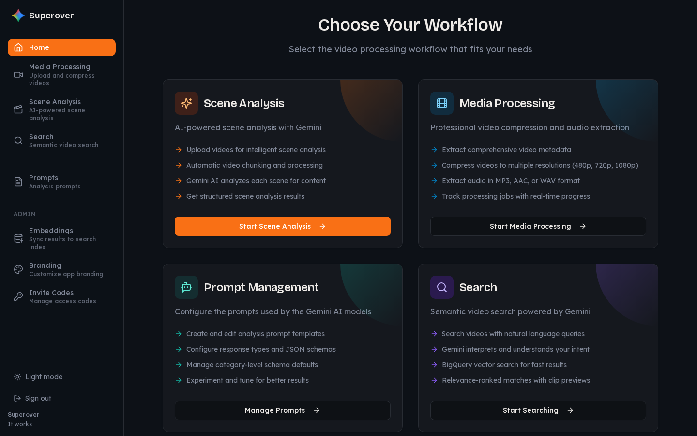
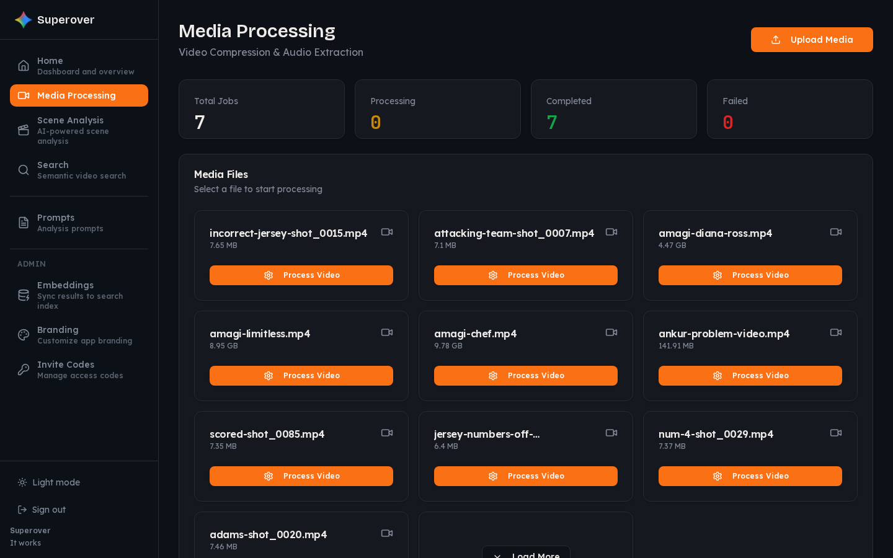
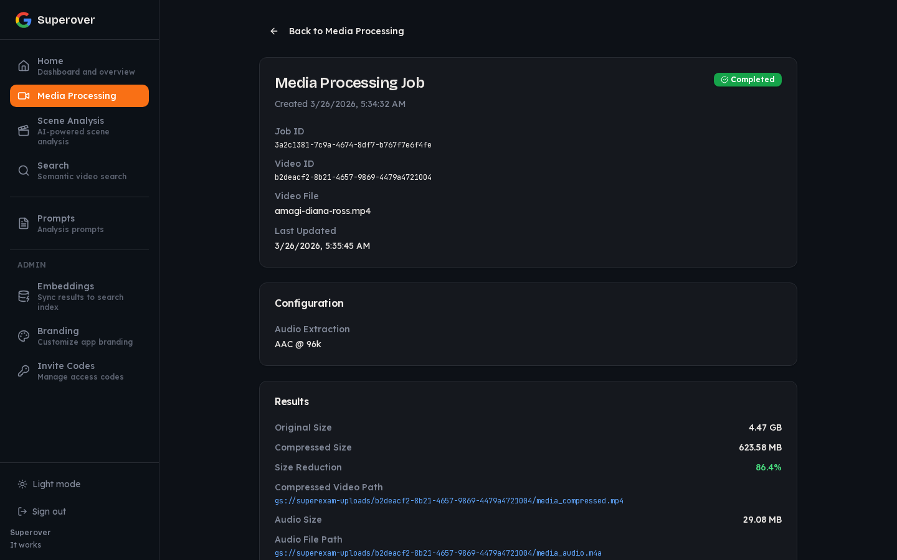
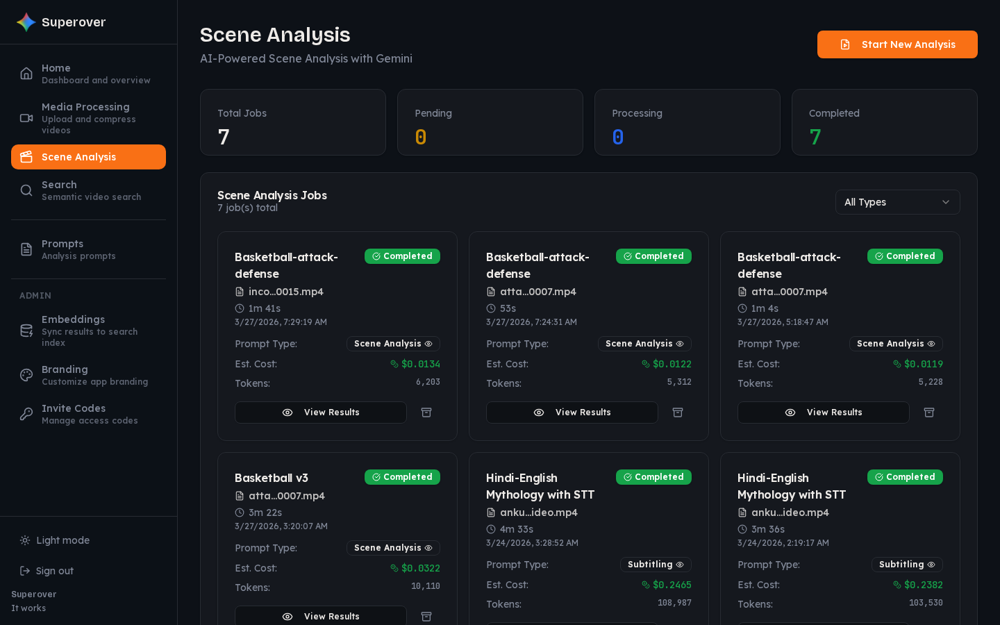
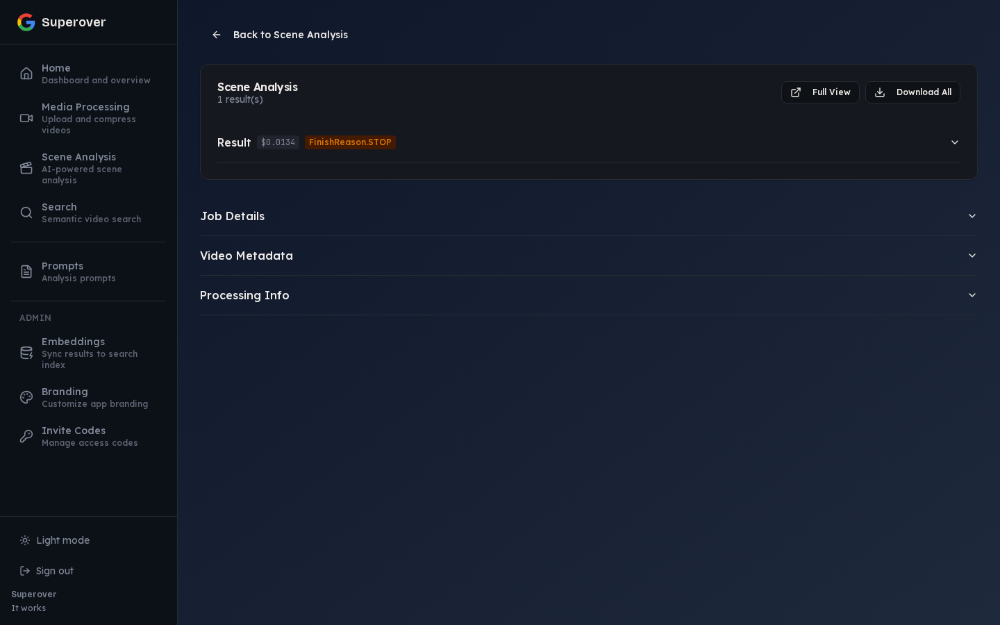
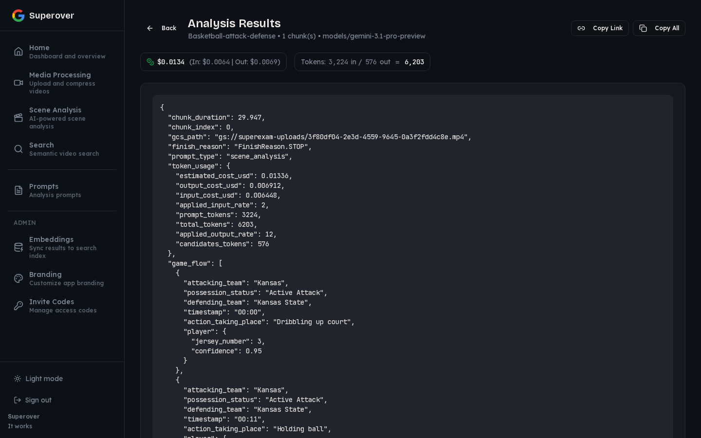
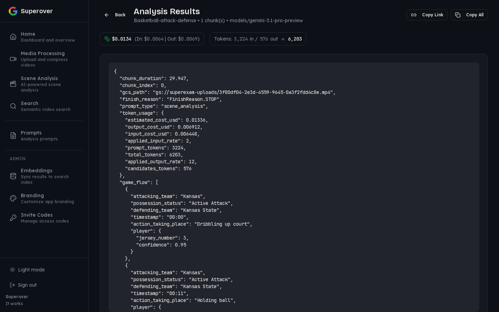
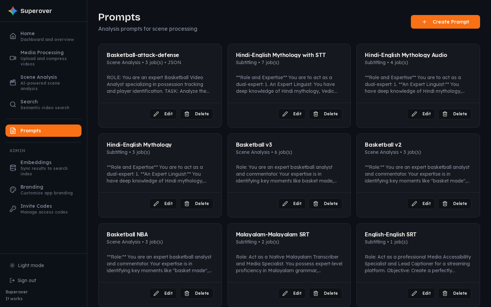
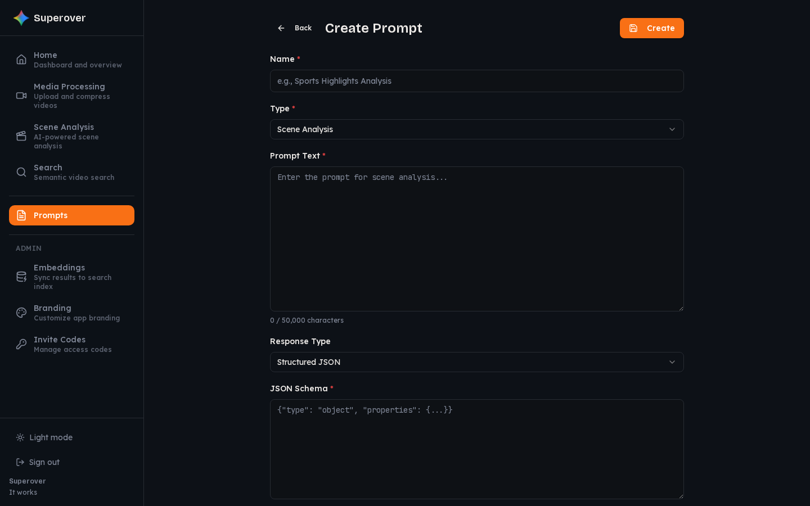
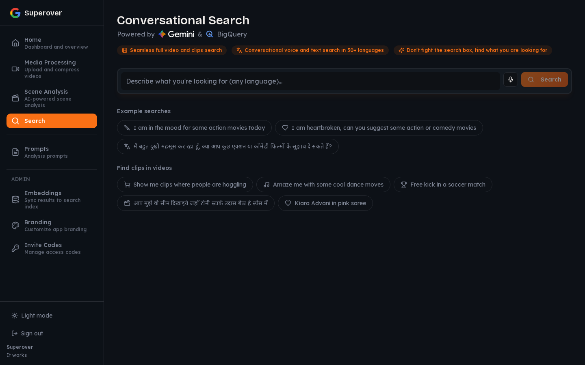

# Super Over Alchemy

AI-powered video analysis platform built on Google Gemini.

> **Problem:** Analyzing video content at scale requires expensive tools and manual effort to extract structured insights from scenes.
> **Solution:** Super Over Alchemy automates video analysis using Gemini for structured scene extraction, media compression, and semantic search — all orchestrated through a FastAPI backend on Cloud Run with a React frontend and Firestore for state.

---

## Home

Dashboard with workflow selection cards for all platform features.

---

## Media Processing

Upload videos and run compression, audio extraction, and image adaptation jobs. Track processing status with real-time progress.

[List](#media-list) · [Detail](#media-detail)

### Media List

### Media Detail
Job info, configuration, and results in a single view.

---

## Scene Analysis

AI-powered scene analysis using Gemini structured output. Upload a video, select a prompt, and get structured scene-by-scene analysis with cost tracking.

[List](#scene-analysis-list) · [Detail](#scene-detail) · [Results](#scene-results)

### Scene Analysis List

### Scene Detail
Analysis results with download options, metadata accordions for job details, video metadata, and processing info.

### Scene Results
Full analysis output with cost breakdown, token counts, and chunked content.

---

## Prompts

Manage AI prompt templates that drive each analysis step. Create, edit, and configure response types and JSON schemas for Gemini.

[List](#prompts-list) · [Create](#prompts-create) · [Detail](#prompts-detail)

### Prompts List

### Create Prompt

### Prompt Detail

---

## Search

Conversational semantic video search powered by Gemini and BigQuery. Search your video library with natural language queries and get relevance-ranked results with clip previews.

