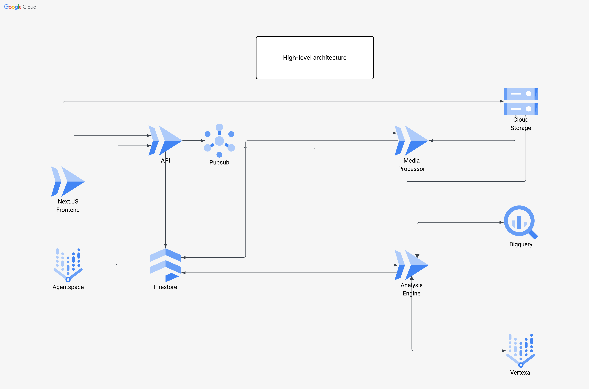

# Super Over Alchemy

AI-powered video analysis platform using Google Gemini, featuring separated media processing and scene analysis
workflows with custom prompt management and context file support.

## Features

### Media Processing Workflow

- **Video Compression**: Multi-resolution transcoding (360p-2160p) with configurable CRF and presets
- **Audio Extraction**: Multiple formats (MP3, AAC, WAV) with configurable bitrates
- **Metadata Analysis**: Automatic extraction of video/audio properties
- **Job Management**: Track processing status, progress, and results

### Scene Analysis Workflow

- **Custom Prompts**: Create and manage reusable analysis prompts with different types
- **Context Support**: Upload additional context files (text, markdown, JSON) to enhance analysis accuracy
- **Flexible Chunking**: Optional video/audio chunking for long files (or analyze entire files)
- **AI-Powered Analysis**: Leverage Google Gemini 2.5 Pro for intelligent scene understanding
- **Multiple Analysis Types**: Scene detection, object identification, transcription, character identification, key
  moments, sentiment analysis, and more

### Technical Features

- **Dual Worker Architecture**: Separate workers for media processing and scene analysis
- **Sequential/Parallel Processing**: Configurable processing modes for scene analysis
- **Cloud-Native**: Designed for local development with easy Cloud Run deployment
- **Modern Frontend**: Next.js 15 with TypeScript, TailwindCSS, and shadcn/ui

## Architecture



### System Components

**Frontend Layer**

- **Next.js Frontend** - React-based UI for media upload, job management, and results visualization
- **Agentspace** - User interaction and workflow orchestration

**API & Messaging**

- **FastAPI** - RESTful API handling requests, job creation, and status queries
- **Pub/Sub** - Event-driven messaging for asynchronous job processing

**Data Layer**

- **Firestore** - NoSQL database storing videos, jobs, prompts, and analysis results
- **Cloud Storage** - Object storage for uploaded media, processed outputs, and context files

**Processing Layer**

- **Media Processor** - FFmpeg-based worker for video compression and audio extraction
- **Analysis Engine** - AI-powered scene analysis using Google Gemini (Vertex AI)

**Analytics**

- **BigQuery** - Data warehouse for analytics and reporting on job metrics and results

### Data Flow

1. **Upload**: Frontend → API → Cloud Storage
2. **Job Creation**: API → Firestore → Pub/Sub
3. **Media Processing**: Media Processor reads from Pub/Sub, processes files, writes to Cloud Storage
4. **Scene Analysis**: Analysis Engine reads from Pub/Sub, calls Vertex AI, stores results in Firestore
5. **Analytics**: Results exported to BigQuery for analysis

## Sequence Diagrams

Detailed sequence diagrams are available for both workflows:

- **[Media Worker Sequence Diagram](docs/media-worker-sequence.md)** - Shows the complete flow from video upload through
  processing to result delivery
- **[Scene Worker Sequence Diagram](docs/scene-worker-sequence.md)** - Shows the scene analysis workflow including
  context file support, chunking strategies, and Gemini integration

## Workflows

### Workflow 1: Media Processing

```
Upload Video/Audio → Create Media Job → Worker Processes → Results Available
                            ↓
                    Configure: Resolution, Audio Format, Bitrate, CRF, Preset
```

### Workflow 2: Scene Analysis

```
Select Processed Media → Choose Prompt → Upload Context (Optional) → Configure Chunking → Start Analysis
                                                                              ↓
                                                                      Worker Analyzes with Gemini
                                                                              ↓
                                                                      View Results in Frontend
```

## Local Development Setup

### Prerequisites

1. **Python 3.9+**

   ```bash
   python --version
   ```

2. **ffmpeg** (for media processing)

   ```bash
   # macOS
   brew install ffmpeg

   # Ubuntu/Debian
   sudo apt-get install ffmpeg

   # Verify
   ffmpeg -version
   ```

3. **Google Cloud SDK**

   ```bash
   # macOS
   brew install --cask google-cloud-sdk

   # Login and set project
   gcloud auth application-default login
   gcloud config set project YOUR_PROJECT_ID
   ```

4. **Node.js 18+ and npm** (for frontend)
   ```bash
   node --version
   npm --version
   ```

### GCP Setup

1. **Create GCP Project**

   ```bash
   export PROJECT_ID="your-project-id"
   gcloud config set project $PROJECT_ID
   ```

2. **Enable APIs**

   ```bash
   gcloud services enable \
     storage.googleapis.com \
     firestore.googleapis.com
   ```

3. **Create GCS Buckets**

   ```bash
   gsutil mb -l asia-south1 gs://${PROJECT_ID}-uploads
   gsutil mb -l asia-south1 gs://${PROJECT_ID}-processed
   ```

4. **Create Firestore Database**

   ```bash
   gcloud firestore databases create --location=asia-south1
   ```

5. **Get Gemini API Key**
   - Visit [Google AI Studio](https://aistudio.google.com/apikey)
   - Create an API key

### Backend Setup

1. **Install Python dependencies**

   ```bash
   cd super-over-alchemy
   python -m venv venv
   source venv/bin/activate  # On Windows: venv\Scripts\activate
   pip install -r requirements.txt
   ```

2. **Configure environment**

   ```bash
   cp .env.example .env
   # Edit .env with your values
   ```

   Example `.env`:

   ```bash
   # GCP Configuration
   GCP_PROJECT_ID=your-project-id
   GCP_REGION=asia-south1

   # GCS Buckets
   UPLOADS_BUCKET=your-project-id-uploads
   PROCESSED_BUCKET=your-project-id-processed

   # Gemini API
   GEMINI_API_KEY=your-gemini-api-key
   GEMINI_MODEL=models/gemini-2.5-pro
   GEMINI_MAX_OUTPUT_TOKENS=65536

   # Worker Settings
   WORKER_POLL_INTERVAL_SECONDS=5
   MAX_CONCURRENT_TASKS=3

   # Scene Processing Mode
   SCENE_PROCESSING_MODE=sequential  # or "parallel"
   MAX_GEMINI_WORKERS=10

   # Environment
   ENVIRONMENT=local
   API_URL=http://localhost:8000
   FRONTEND_URL=http://localhost:3000
   ```

3. **Run the API**

   ```bash
   python api/main.py
   ```

   API available at `http://localhost:8000`

   - Swagger docs: `http://localhost:8000/docs`
   - Health check: `http://localhost:8000/health`

4. **Run the Workers** (in separate terminals)

   ```bash
   # Terminal 1: Media Worker
   source venv/bin/activate
   python workers/media_worker.py

   # Terminal 2: Scene Worker
   source venv/bin/activate
   python workers/scene_worker.py
   ```

### Frontend Setup

1. **Install dependencies**

   ```bash
   cd frontend
   npm install
   ```

2. **Configure environment**

   ```bash
   cp .env.local.example .env.local
   # Edit .env.local with your API URL
   ```

   Example `.env.local`:

   ```bash
   NEXT_PUBLIC_API_URL=http://localhost:8000
   ```

3. **Run development server**

   ```bash
   npm run dev
   ```

   Frontend available at `http://localhost:3000`

4. **Build for production**
   ```bash
   npm run build
   npm start
   ```

## Usage Guide

### 1. Upload and Process Media

1. Navigate to `http://localhost:3000/media`
2. Click "Upload Video" and select a file
3. Configure processing options:
   - Compression resolution (360p-2160p)
   - Audio format (MP3, AAC, WAV)
   - Audio bitrate
   - CRF (quality: 0-51, lower = better)
   - Preset (speed vs efficiency)
4. Click "Start Processing"
5. Monitor job status in the dashboard

### 2. Create Analysis Prompts

1. Navigate to `http://localhost:3000/prompts`
2. Click "Create Prompt"
3. Fill in:
   - Name (e.g., "Sports Commentary Analysis")
   - Type (Scene Analysis, Subtitling, Custom, etc.)
   - Prompt text (instructions for Gemini)
   - **Optional**: Check "Supports additional context files"
   - **Optional**: Add context description
4. Save the prompt

### 3. Analyze Scenes

1. Navigate to `http://localhost:3000/scene-analysis`
2. Click "Start New Analysis"
3. Select processed media (compressed video or extracted audio)
4. Choose a prompt from the dropdown
5. **If prompt supports context**: Upload additional context files (text, markdown, JSON)
6. Configure chunking:
   - No chunking (recommended for audio < 5 hours, video < 1 hour)
   - Or set chunk duration (60s, 120s, 5min, 10min)
7. Click "Start Scene Analysis"
8. View results when processing completes

### 4. API Usage (Programmatic)

#### Create Media Job

```bash
curl -X POST http://localhost:8000/api/media/jobs \
  -H "Content-Type: application/json" \
  -d '{
    "video_id": "video-uuid",
    "config": {
      "compress": true,
      "compress_resolution": "720p",
      "extract_audio": true,
      "audio_format": "mp3",
      "audio_bitrate": "192k",
      "crf": 23,
      "preset": "medium"
    }
  }'
```

#### Create Scene Job

```bash
curl -X POST http://localhost:8000/api/scenes/{video_id}/process \
  -H "Content-Type: application/json" \
  -d '{
    "prompt_id": "prompt-uuid",
    "compressed_video_path": "gs://bucket/path/to/video.mp4",
    "chunk_duration": 0,
    "chunk": false,
    "context_items": [
      {
        "context_id": "ctx-uuid",
        "type": "text",
        "gcs_path": "gs://bucket/context/file.txt",
        "filename": "reference.txt",
        "description": "Player statistics",
        "size_bytes": 1024
      }
    ]
  }'
```

## Project Structure

```
super-over-alchemy/
├── api/                          # FastAPI REST API
│   ├── main.py                  # Application entry point
│   ├── routes/
│   │   ├── scenes.py            # Scene analysis endpoints
│   │   ├── media.py             # Media processing endpoints
│   │   ├── prompts.py           # Prompt management endpoints
│   │   └── tasks.py             # Task status endpoints
│   └── models/
│       └── schemas.py           # Pydantic request/response models
├── libs/                         # Shared libraries
│   ├── storage.py               # Google Cloud Storage client
│   ├── database.py              # Firestore client with collections
│   ├── video_processing/        # FFmpeg-based processing
│   │   ├── metadata.py          # Probe video/audio metadata
│   │   ├── compressor.py        # Video transcoding
│   │   ├── chunker.py           # Video chunking
│   │   ├── audio.py             # Audio extraction
│   │   └── manifest.py          # Processing manifests
│   ├── gemini/                  # Gemini AI integration
│   │   └── scene_analyzer.py   # Scene analysis with context support
│   └── scene_processing/        # Scene processing strategies
│       ├── base.py              # Abstract processor
│       ├── sequential.py        # Sequential chunk processing
│       ├── parallel.py          # Parallel chunk processing
│       └── factory.py           # Processor factory
├── workers/                      # Background job processors
│   ├── media_worker.py          # Media processing worker
│   └── scene_worker.py          # Scene analysis worker
├── frontend/                     # Next.js 15 frontend
│   ├── app/                     # App router pages
│   │   ├── media/               # Media workflow
│   │   ├── prompts/             # Prompt management
│   │   ├── scene-analysis/      # Scene analysis workflow
│   │   └── scene/               # Scene results
│   ├── components/              # React components
│   │   ├── ui/                  # shadcn/ui components
│   │   ├── media/               # Media-specific components
│   │   ├── scene/               # Scene-specific components
│   │   └── prompts/             # Prompt components
│   └── lib/                     # Frontend utilities
│       ├── api-client.ts        # API client with typed methods
│       ├── types.ts             # TypeScript types
│       └── utils.ts             # Helper functions
├── tests/                        # Test suites
├── storage/temp/                 # Local temporary files
├── config.py                     # Centralized configuration
├── requirements.txt              # Python dependencies
├── .env.example                 # Environment template
└── README.md                    # This file
```

## Configuration

### Key Environment Variables

| Variable                   | Description            | Default                       | Example                 |
| -------------------------- | ---------------------- | ----------------------------- | ----------------------- |
| `GEMINI_MODEL`             | Gemini model to use    | `models/gemini-2.0-flash-exp` | `models/gemini-2.5-pro` |
| `GEMINI_MAX_OUTPUT_TOKENS` | Max tokens in response | `8192`                        | `65536` (for 2.5 Pro)   |
| `SCENE_PROCESSING_MODE`    | Sequential or parallel | `sequential`                  | `parallel`              |
| `MAX_GEMINI_WORKERS`       | Parallel worker count  | `10`                          | `4`                     |
| `CHUNK_DURATION_SECONDS`   | Default chunk size     | `30`                          | `0` (no chunking)       |
| `COMPRESS_RESOLUTION`      | Default resolution     | `480p`                        | `720p`                  |

### Processing Modes

**Sequential Mode** (Default)

- Processes one chunk at a time
- Lower memory usage
- Predictable performance
- Recommended for most use cases

**Parallel Mode**

- Processes multiple chunks simultaneously
- Higher memory usage
- Faster for long videos with many chunks
- Uses process-based parallelism (isolated SSL contexts)

## Advanced Features

### Context File Support

Upload additional context files to enhance analysis accuracy:

1. Create a prompt with "Supports additional context files" enabled
2. During scene analysis, upload text files (.txt, .md, .json) up to 10MB
3. Context is loaded once and included with all chunks
4. Gemini receives: prompt + context + video/audio

**Use Cases**:

- Sports analysis: Upload team rosters, player stats
- Educational content: Upload lecture notes, reference material
- Product reviews: Upload specification sheets
- Interview analysis: Upload company background, job description

### Custom Prompts

Create specialized prompts for different analysis types:

- **Scene Analysis**: General scene understanding and visual analysis
- **Object Identification**: Detect and track objects, brands, or specific items
- **Subtitling**: Generate SRT-formatted subtitles and transcriptions
- **Key Moments**: Identify highlights, important events, and memorable scenes
- **Cliffhanger Analysis**: Detect suspenseful moments and dramatic endings
- **Custom**: Any specialized analysis task tailored to your needs

### Chunking Strategies

**No Chunking** (Recommended for most cases)

- Analyzes entire file as one piece
- Better API quota usage (4× more efficient)
- No timestamp ordering issues
- Best for: Audio < 5 hours, Video < 1 hour

**Fixed Duration Chunking**

- Split into equal segments (60s, 120s, 5min, 10min)
- Required for very long files
- Each chunk analyzed separately
- Results combined in order

## Deployment

### Cloud Run Deployment

Coming soon... The application is designed for easy Cloud Run deployment with:

- Containerized API and workers
- Cloud Storage for file handling
- Firestore for state management
- Automatic scaling

## Monitoring and Debugging

### Logs

- **API**: Console logs with FastAPI
- **Workers**: Detailed logging with progress tracking
- **Frontend**: Browser console and Network tab

### Common Issues

1. **Worker not picking up jobs**: Check worker is running and polling interval
2. **Gemini API errors**: Verify API key and model availability
3. **Video processing fails**: Ensure ffmpeg is installed and accessible
4. **Context upload fails**: Check file size < 10MB and format (.txt, .md, .json)

## Contributing

This is a personal project. Feel free to fork and modify for your own use.

## License

MIT
